## BAGIAN 2: KLASIFIKASI (PREDIKSI KATEGORI)

---

## 🎯 APA ITU KLASIFIKASI?

**Klasifikasi** adalah cara komputer menebak **kategori atau golongan**.

Bayangkan kamu ingin menebak:
- 🏥 "Apakah pasien ini kena diabetes?" → Ya / Tidak
- 📧 "Apakah email ini spam?" → Spam / Bukan Spam
- 🍎 "Ini buah apa?" → Apel / Jeruk / Pisang

Nah, klasifikasi adalah teknik untuk menjawab pertanyaan **"YA atau TIDAK"** atau **"INI ATAU ITU"**!

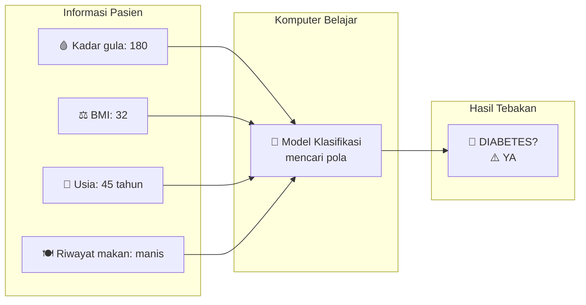

---

## 📚 PERBEDAAN REGRESI VS KLASIFIKASI

| Aspek | Regresi (sebelumnya) | Klasifikasi (sekarang) |
|-------|---------------------|----------------------|
| **Output** | Angka (75, 200000, 28.5) | Kategori (Ya/Tidak, Merah/Biru) |
| **Contoh** | "Harga minyak besok 850rb" | "Apakah harga naik? Ya" |
| **Pertanyaan** | "Berapa banyak?" | "Apakah ini?" |

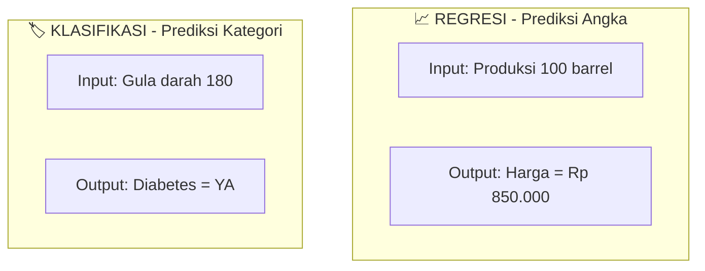

---

## 🎲 TIGA JENIS MODEL KLASIFIKASI

Ada 3 model yang akan kita pelajari:

| No | Model | Gambaran Sederhana |
|----|-------|-------------------|
| 1 | **Logistic Regression** | Seperti garis lengkung S yang memisahkan YA dan TIDAK |
| 2 | **Decision Tree Classifier** | Sama seperti sebelumnya, tapi outputnya YA/TIDAK |
| 3 | **Random Forest Classifier** | Musyawarah banyak pohon, hasil voting |

---

## 1️⃣ LOGISTIC REGRESSION - "Garis Lengkung S"

### 📖 Penjelasan Sederhana

Kalau Linear Regression pake garis lurus, **Logistic Regression pake garis berbentuk huruf S**. Kenapa? Karena untuk menjawab YA/TIDAK, kita perlu sesuatu yang menghasilkan antara 0 dan 1.

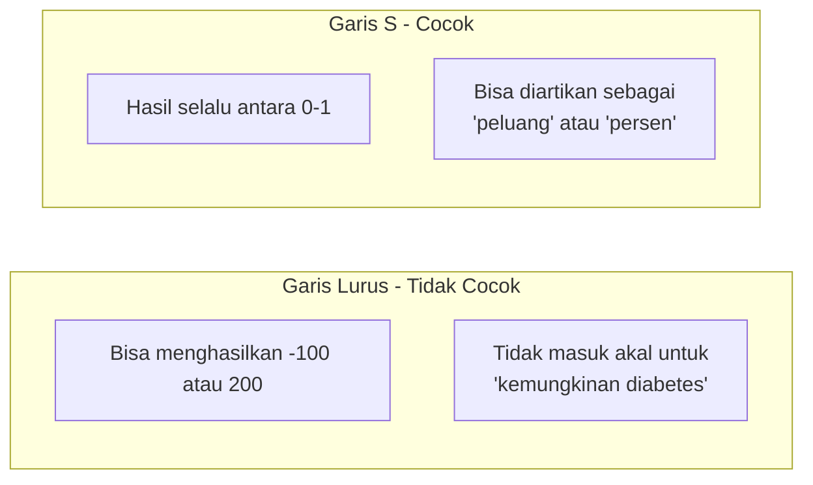

### 🎮 Cara Kerja (Cerita Sederhana)

**Cerita: Dokter Mendiagnosis Diabetes**

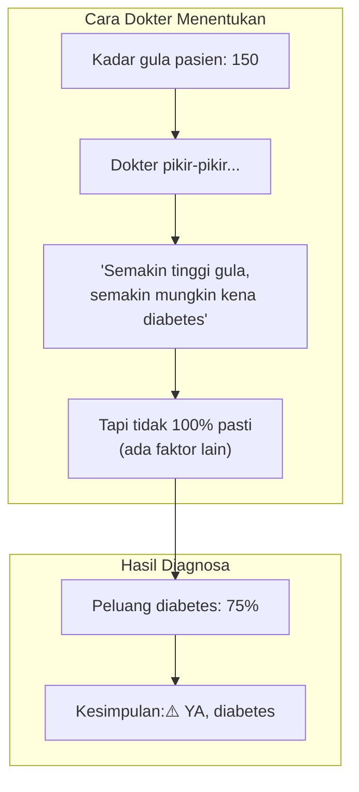

**Logistic Regression melakukan hal yang sama!** Dia menghitung **PELUANG** (antara 0% sampai 100%) lalu memutuskan:

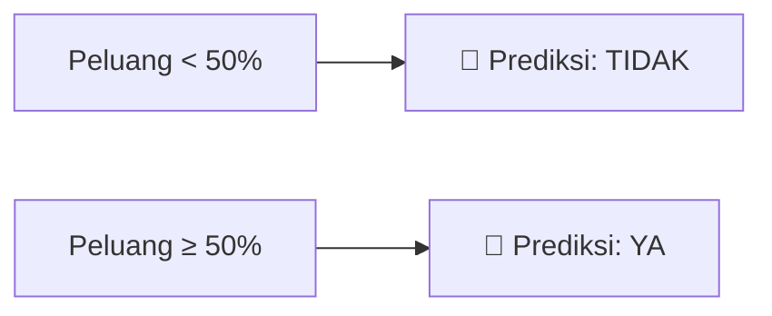

### 📊 Visualisasi Kurva S

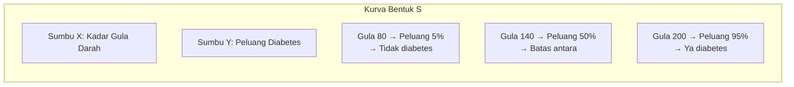

### 🎯 Batas Keputusan (Threshold)

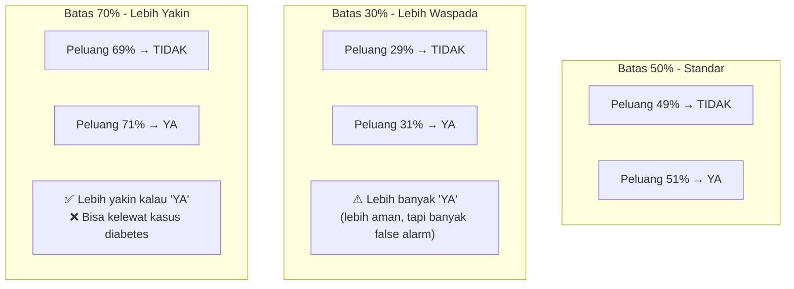

### ✅ Kelebihan & ❌ Kekurangan

| ✅ Kelebihan | ❌ Kekurangan |
|-------------|---------------|
| Sederhana dan cepat | Hanya bisa garis pemisah yang sederhana |
| Memberikan peluang (bukan tebakan kaku) | Kurang akurat untuk pola rumit |
| Mudah diinterpretasi | Sensitif terhadap data aneh (outlier) |
| Cocok sebagai baseline | |

### 💬 Kapan Pakai?

> "Pakai Logistic Regression kalau baru mulai atau butuh tebakan cepat dengan penjelasan peluang"

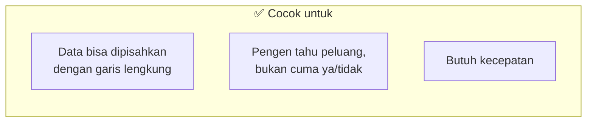

---

## 2️⃣ DECISION TREE CLASSIFIER - "Tebak-tebakan YA/TIDAK"

### 📖 Penjelasan Sederhana

Decision Tree untuk klasifikasi **sama persis** dengan yang sudah kita pelajari di regresi! Bedanya hanya:
- **Regresi**: daunnya berisi ANGKA (rata-rata harga)
- **Klasifikasi**: daunnya berisi KATEGORI (suara terbanyak)

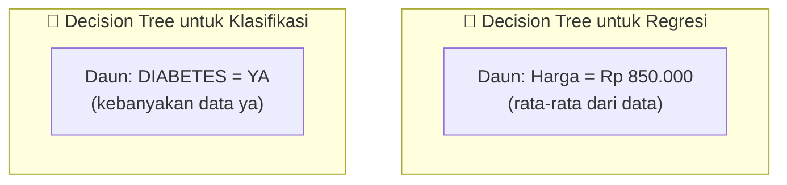

### 🎮 Cara Kerja (Cerita Sederhana)

**Cerita: Deteksi Diabetes dengan Pertanyaan**

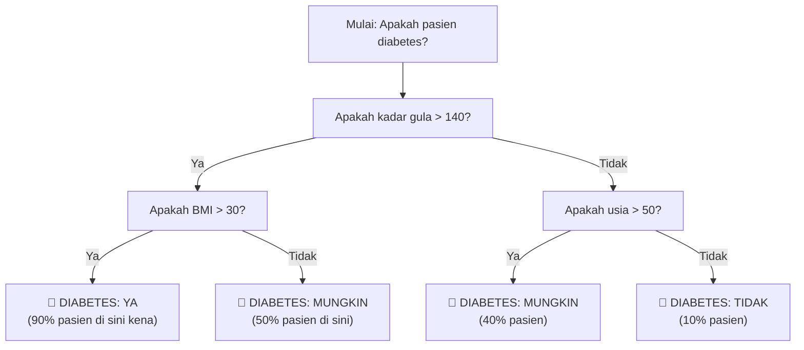

### 🌳 Bagaimana Pohon Memutuskan?

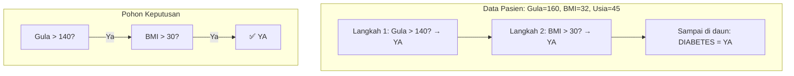

### ⚠️ Masalah yang Sama: Overfitting

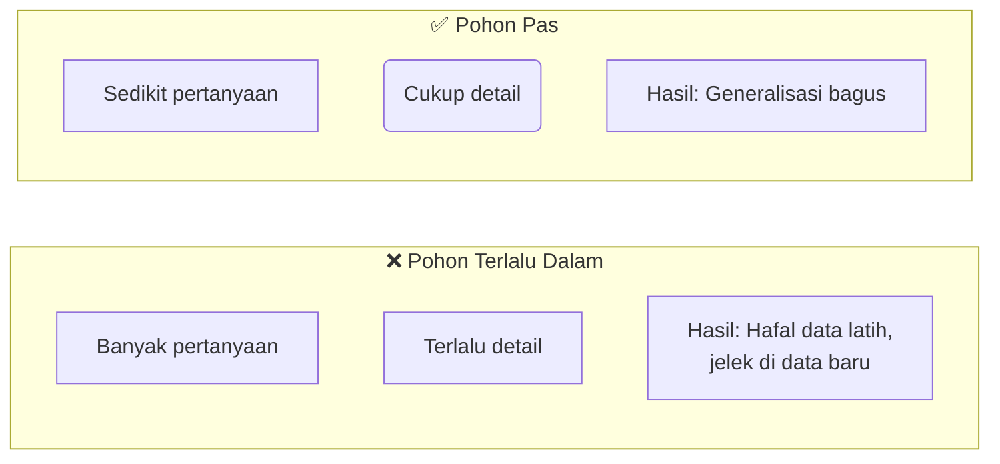

**Contoh Overfitting:**
```
Pohon yang terlalu detail:
"Apakah gula > 140? → Ya → Apakah BMI > 30? → Ya → 
 Apakah usia > 45? → Ya → Apakah tekanan darah > 130? → Ya → 
 Apakah kolesterol > 200? → Ya → DIABETES"

Terlalu banyak syarat! Kalau ada pasien yang sedikit berbeda, bisa salah tebak.
```

### ✅ Kelebihan & ❌ Kekurangan

| ✅ Kelebihan | ❌ Kekurangan |
|-------------|---------------|
| Mudah dijelaskan ke pasien | Suka overfitting (terlalu detail) |
| Bisa lihat alur keputusan | Kurang stabil |
| Tidak perlu persiapan data ribet | Akurasi biasa aja |

### 💬 Kapan Pakai?

> "Pakai Decision Tree kalau kamu mau jelaskan ke dokter atau pasien alasan di balik diagnosis"

---

## 3️⃣ RANDOM FOREST CLASSIFIER - "Musyawarah Banyak Ahli"

### 📖 Penjelasan Sederhana

Sama seperti di regresi, **Random Forest untuk klasifikasi** juga kumpulan banyak pohon yang **voting** untuk menentukan jawaban.

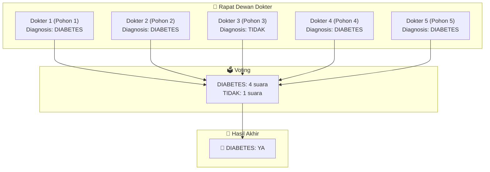

### 🎮 Cara Kerja (Cerita Sederhana)

**Cerita: Second Opinion ke Banyak Dokter**

Bayangkan kamu sakit dan minta pendapat ke 5 dokter berbeda:

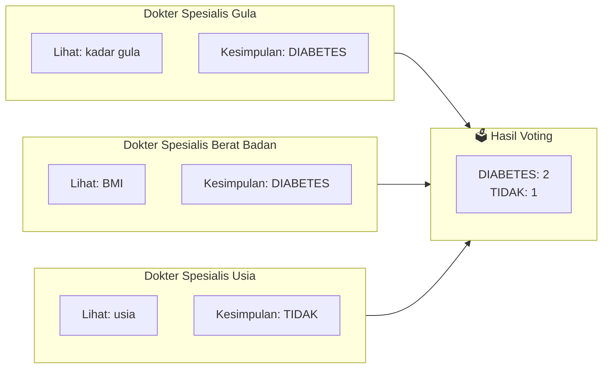

**Random Forest melakukan hal yang sama!** Setiap pohon (dokter) punya spesialisasi berbeda:

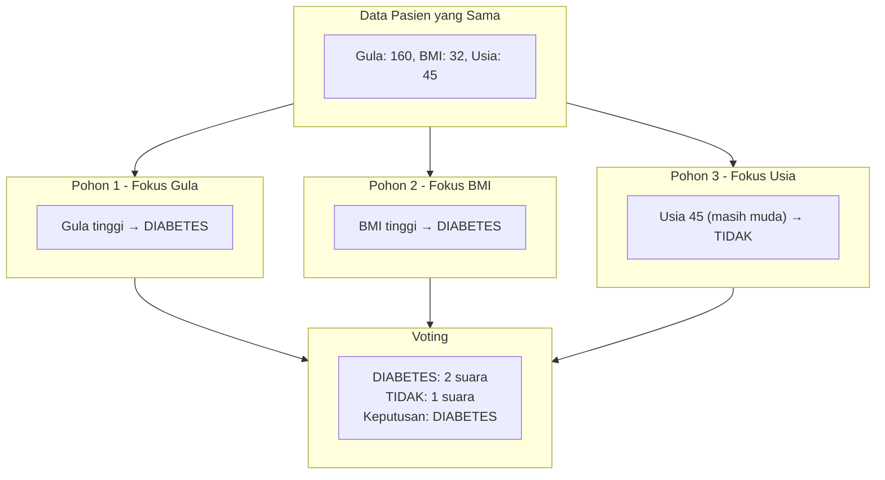

### 🗳️ Cara Voting pada Random Forest

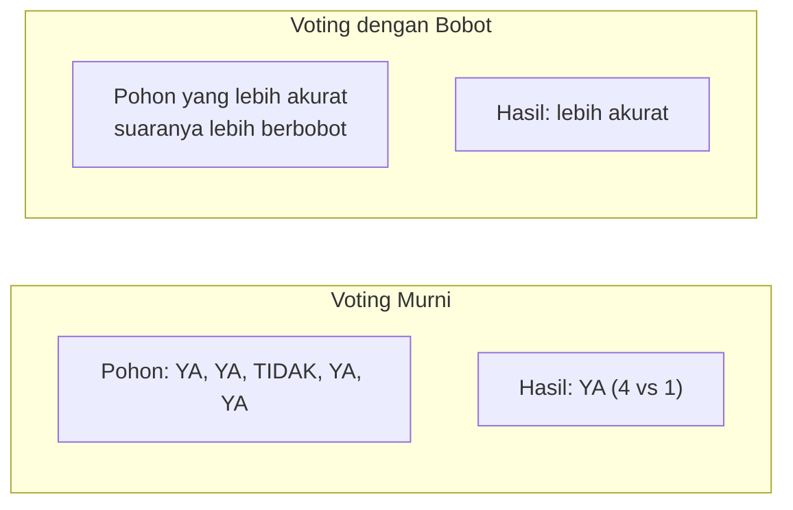

### 💪 Kenapa Random Forest Paling Akurat?

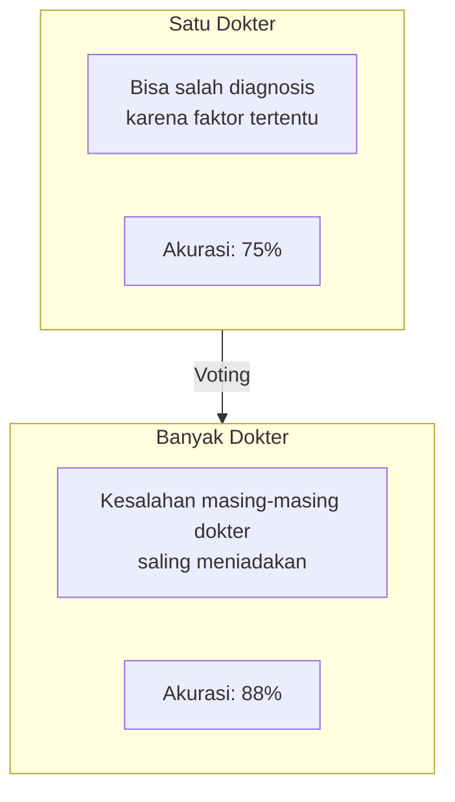

### ✅ Kelebihan & ❌ Kekurangan

| ✅ Kelebihan | ❌ Kekurangan |
|-------------|---------------|
| Akurasi PALING TINGGI | Lambat (banyak pohon) |
| Tidak mudah salah | Susah jelasin ke pasien |
| Bisa tangkap pola rumit | Butuh memori besar |
| Paling andal | |

### 💬 Kapan Pakai?

> "Pakai Random Forest kalau akurasi adalah prioritas #1 kamu"

---

## 📊 PERBANDINGAN KETIGA KLASIFIKASI

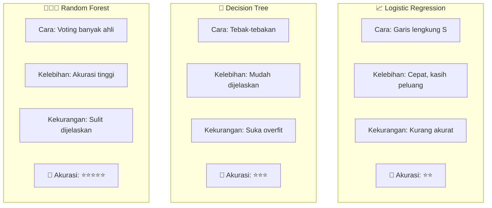

### 🎯 Tabel Pilih-pilih Model Klasifikasi

| Situasi Kamu | Model yang Cocok |
|--------------|------------------|
| Baru belajar, mau coba-coba | Logistic Regression |
| Perlu tahu peluang (bukan cuma ya/tidak) | Logistic Regression |
| Perlu jelaskan ke pasien/atasan | Decision Tree |
| Data masih kecil (<1000) | Decision Tree |
| Mau akurasi setinggi mungkin | Random Forest |
| Data besar (>5000) | Random Forest |
| Aplikasi kritis (medis, keamanan) | Random Forest |

---

## 📏 CARA MENGUKUR KEBERHASILAN KLASIFIKASI

### Matriks Kebingungan (Confusion Matrix) - Penjelasan Sederhana

Bayangkan kamu punya 100 pasien, modelmu memprediksi siapa yang kena diabetes:

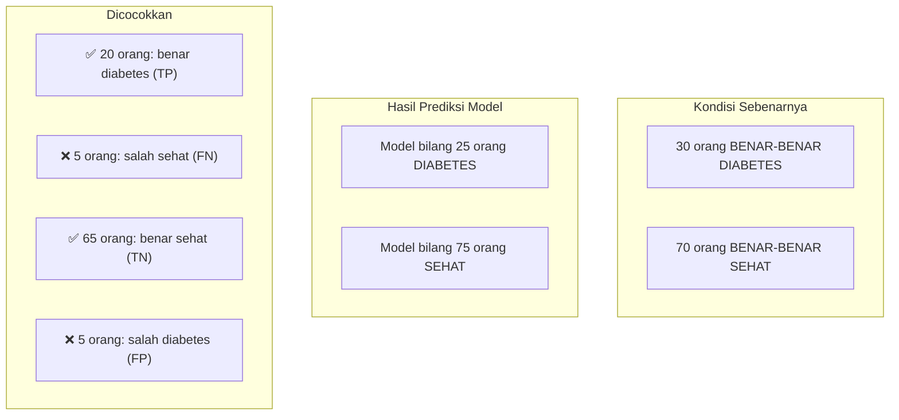

**Empat kemungkinan hasil:**

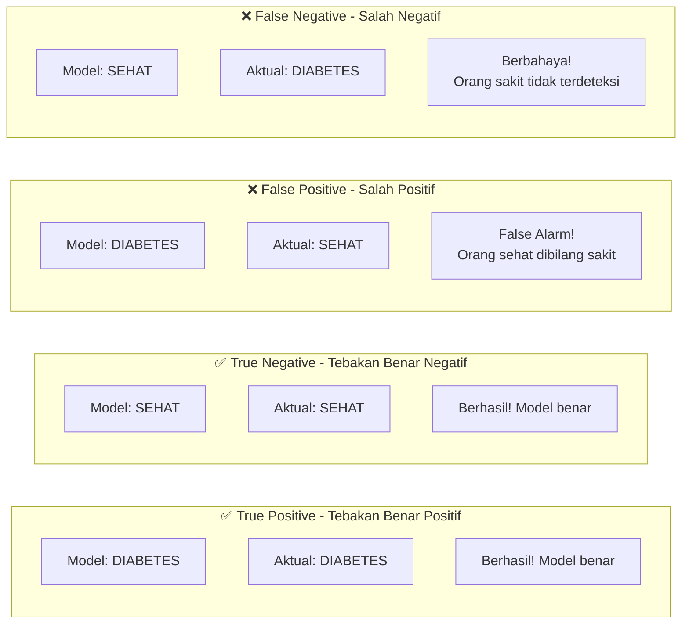

### Metrik Evaluasi - Penjelasan Sederhana

```mermaid
graph TD
    subgraph Accuracy [Akurasi - Seberapa Sering Benar?]
        A1["(TP + TN) / Total"]
        A2["(20 + 65) / 100 = 85%"]
        A3["Model benar 85% dari waktu"]
    end
    
    subgraph Precision [Presisi - Kalau Bilang Diabetes, Seberapa Yakin?]
        P1["TP / (TP + FP)"]
        P2["20 / (20 + 5) = 80%"]
        P3["Kalau model bilang diabetes,<br/>80% benerannya diabetes"]
    end
    
    subgraph Recall [Recall - Dari Semua Penderita, Berapa yang Terdeteksi?]
        R1["TP / (TP + FN)"]
        R2["20 / (20 + 5) = 80%"]
        R3["Dari 25 penderita,<br/>model mendeteksi 20 orang (80%)"]
    end
    
    subgraph F1 [F1-Score - Keseimbangan Presisi & Recall]
        F1["Rata-rata khusus dari Presisi & Recall"]
        F2["2 × (P×R)/(P+R)"]
        F3["= 2 × (0.8×0.8)/(0.8+0.8) = 80%"]
    end
```

### 📖 Analogi Sederhana Metrik

Bayangkan kamu jadi **pemeriksa di bandara** yang menangkap penumpang berbahaya:

| Metrik | Analogi di Bandara |
|--------|-------------------|
| **Akurasi** | Dari semua penumpang, berapa persen keputusanmu yang benar? |
| **Presisi** | Dari yang kamu tangkap, berapa persen yang benar-benar berbahaya? |
| **Recall** | Dari semua penumpang berbahaya, berapa persen yang kamu tangkap? |
| **F1** | Keseimbangan antara presisi dan recall |

```mermaid
graph LR
    subgraph Waspada [Kalau Mau Lebih Waspada]
        W1["Prioritaskan RECALL"]
        W2["Tangkap sebanyak mungkin<br/>penumpang berbahaya"]
        W3["Konsekuensi: Banyak false alarm<br/>(orang baik ditangkap)"]
    end
    
    subgraph Yakin [Kalau Mau Pasti]
        Y1["Prioritaskan PRESISI"]
        Y2["Hanya tangkap yang benar-benar<br/>terbukti berbahaya"]
        Y3["Konsekuensi: Banyak yang lolos<br/>(penumpang bahaya tidak tertangkap)"]
    end
    
    subgraph Seimbang [Kalau Mau Seimbang]
        S1["Prioritaskan F1"]
        S2["Keseimbangan antara<br/>waspada dan kepastian"]
    end
```

---

## 🧪 CONTOH KODE SEDERHANA

```python
# KODE KLASIFIKASI SEDERHANA

from sklearn.linear_model import LogisticRegression
from sklearn.tree import DecisionTreeClassifier
from sklearn.ensemble import RandomForestClassifier
from sklearn.metrics import accuracy_score, confusion_matrix

# Data pasien (gula, BMI, usia) dan diagnosis (0=Tidak, 1=Ya)
# Data kecil untuk contoh
gula = [120, 150, 180, 110, 200, 130, 170, 140]  # kadar gula
bmi = [25, 30, 35, 22, 32, 28, 33, 29]            # BMI
usia = [30, 45, 50, 25, 55, 35, 48, 42]           # usia
diabetes = [0, 1, 1, 0, 1, 0, 1, 1]               # 0=Tidak, 1=Ya

# Gabungkan fitur
X = list(zip(gula, bmi, usia))
y = diabetes

# Bagi data: 6 data untuk latih, 2 data untuk uji
X_train = X[:6]  # 6 pasien pertama untuk latih
y_train = y[:6]
X_test = X[6:]   # 2 pasien terakhir untuk uji
y_test = y[6:]

print("Data latih (6 pasien):", X_train)
print("Data uji (2 pasien):", X_test)
print("Jawaban uji sebenarnya:", y_test)
print()

# Model 1: Logistic Regression
logistic = LogisticRegression()
logistic.fit(X_train, y_train)
tebakan_logistic = logistic.predict(X_test)
print(f"Logistic Regression tebak: {tebakan_logistic}")

# Model 2: Decision Tree
tree = DecisionTreeClassifier()
tree.fit(X_train, y_train)
tebakan_tree = tree.predict(X_test)
print(f"Decision Tree tebak: {tebakan_tree}")

# Model 3: Random Forest
forest = RandomForestClassifier(n_estimators=10)
forest.fit(X_train, y_train)
tebakan_forest = forest.predict(X_test)
print(f"Random Forest tebak: {tebakan_forest}")

print()
print("Jawaban yang benar:", y_test)
```

**Output yang diharapkan:**
```
Data latih (6 pasien): [(120,25,30), (150,30,45), (180,35,50), (110,22,25), (200,32,55), (130,28,35)]
Data uji (2 pasien): [(170,33,48), (140,29,42)]
Jawaban uji sebenarnya: [1, 1]

Logistic Regression tebak: [1 1]
Decision Tree tebak: [1 1]
Random Forest tebak: [1 1]

Jawaban yang benar: [1, 1]
```

---

## 💡 RINGKASAN SINGKAT KLASIFIKASI

```mermaid
mindmap
  root((PILIH MODEL<br/>KLASIFIKASI))
    Logistic Regression
      Garis lengkung S
      Kasih peluang
      Buat baseline
    Decision Tree
      Tebak-tebakan
      Mudah dijelaskan
      Hati-hati overfit
    Random Forest
      Voting banyak pohon
      Paling akurat
      Rekomendasi final
```

### 🔑 Intinya:

> **Logistic Regression** = Tebakan dengan peluang, cepet
> 
> **Decision Tree** = Tebakan pakai pertanyaan, jelas
> 
> **Random Forest** = Tebakan musyawarah, paling jitu

### 📌 Ingat 4 Metrik Penting:

| Metrik | Pertanyaan yang Dijawab |
|--------|------------------------|
| **Akurasi** | Seberapa sering model benar? |
| **Presisi** | Kalau bilang YA, seberapa yakin? |
| **Recall** | Dari yang sebenarnya YA, berapa yang terdeteksi? |
| **F1** | Keseimbangan presisi & recall |
