## BAGIAN 3: CLUSTERING (PENGELOMPOKAN TANPA LABEL)

---

## 🎯 APA ITU CLUSTERING?

**Clustering** adalah cara komputer **mengelompokkan data** yang mirip-mirip ke dalam satu grup, **TANPA diberi tahu jawaban benarnya terlebih dahulu**.

Bayangkan kamu punya banyak bola dengan warna berbeda, tapi kamu buta warna. Kamu hanya bisa meraba dan mengelompokkan bola yang terasa sama:

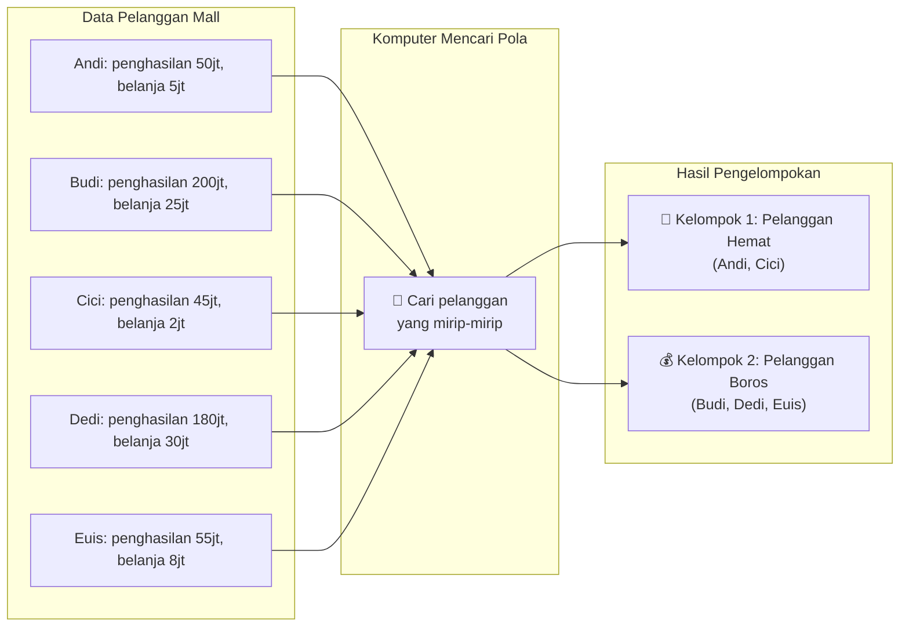

---

## 📚 BEDA CLUSTERING DENGAN REGRESI & KLASIFIKASI

| Aspek | Regresi & Klasifikasi | Clustering |
|-------|---------------------|------------|
| **Ada jawaban benar?** | ✅ ADA (data latih punya label) | ❌ TIDAK ADA (cari sendiri polanya) |
| **Disebut** | Supervised Learning (belajar dengan guru) | Unsupervised Learning (belajar sendiri) |
| **Tujuan** | Memprediksi jawaban | Menemukan kelompok alami |
| **Contoh** | Latih dengan data pasien sakit/sehat | Kelompokkan pelanggan tanpa label |

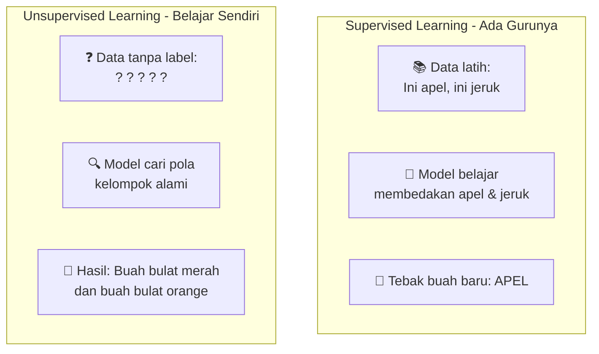

---

## 🎲 K-MEANS CLUSTERING - "Mencari Pusat Keramaian"

### 📖 Penjelasan Sederhana

**K-Means** bekerja seperti kamu mau bagi-bagi titik di peta menjadi K kelompok. Caranya: taruh K titik sebagai "pusat keramaian", lalu setiap titik masuk ke pusat terdekat.

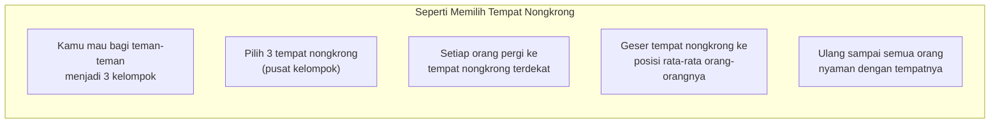

### 🎮 Cara Kerja K-Means (Cerita Sederhana)

**Cerita: Mengelompokkan Pelanggan Mall**

Bayangkan kamu punya data pelanggan berdasarkan penghasilan dan pengeluaran:

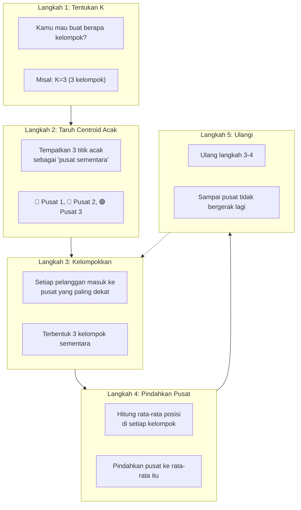

### 🖼️ Visualisasi Langkah Demi Langkah

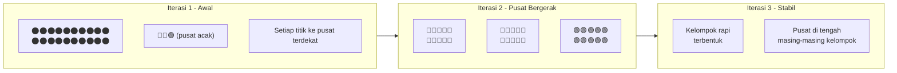

### 🎯 Arti Nama "K-Means"

| Kata | Arti | Penjelasan |
|------|------|------------|
| **K** | Jumlah kelompok | Kamu yang tentukan mau berapa kelompok |
| **Means** | Rata-rata (mean) | Pusat kelompok adalah RATA-RATA posisi semua anggota |

```mermaid
graph LR
    subgraph Kelompok [Satu Kelompok dengan 5 Anggota]
        K1["Titik A: (10, 20)"]
        K2["Titik B: (12, 22)"]
        K3["Titik C: (11, 19)"]
        K4["Titik D: (9, 21)"]
        K5["Titik E: (13, 18)"]
    end
    
    subgraph RataRata [Menghitung Pusat (Means)]
        R1["Rata-rata X = (10+12+11+9+13)/5 = 11"]
        R2["Rata-rata Y = (20+22+19+21+18)/5 = 20"]
        R3["Pusat kelompok = (11, 20)"]
    end
    
    Kelompok --> RataRata
```

---

## 🤔 BAGAIMANA MENENTUKAN K (JUMLAH KELOMPOK)?

Ini adalah pertanyaan terbesar dalam clustering! Karena kita tidak tahu jawaban benarnya, kita harus **mencoba beberapa K dan memilih yang terbaik**.

### Metode 1: Elbow Method (Metode Siku)

**Penjelasan Sederhana:**
Bayangkan kamu melipat kertas. Makin banyak lipatan, makin kecil kertasnya. Tapi setelah titik tertentu, melipat lagi tidak membuat kertas jauh lebih kecil.

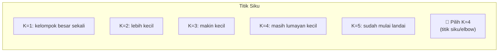

**Cara Membaca Grafik Elbow:**

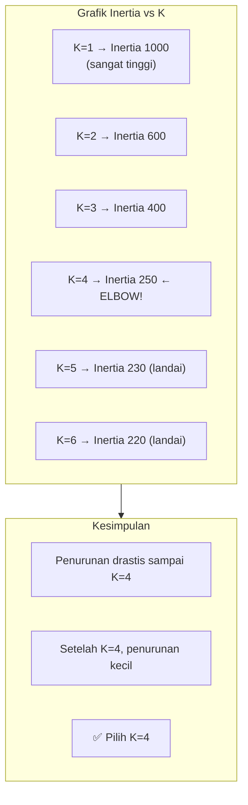

### Metode 2: Silhouette Score

**Penjelasan Sederhana:**
Silhouette mengukur **seberapa cocok** suatu titik dengan kelompoknya sendiri dibanding kelompok lain.

```mermaid
graph LR
    subgraph Bagus [✅ Silhouette Tinggi (+0.5 ke atas)]
        B1["Titik dekat dengan<br/>kelompok sendiri"]
        B2["Titik jauh dari<br/>kelompok lain"]
        B3["Kelompoknya bagus!"]
    end
    
    subgraph Sedang [⚠️ Silhouette Sedang (0 sampai 0.5)]
        S1["Titik cukup dekat<br/>dengan kelompok sendiri"]
        S2["Tapi agak dekat juga<br/>dengan kelompok lain"]
        S3["Kelompoknya lumayan"]
    end
    
    subgraph Buruk [❌ Silhouette Negatif (di bawah 0)]
        U1["Titik lebih dekat ke<br/>kelompok LAIN"]
        U2["Seharusnya pindah kelompok!"]
        U3["Kelompoknya jelek"]
    end
```

**Interpretasi Skor Silhouette:**

| Skor | Arti | Keputusan |
|------|------|-----------|
| **0.7 - 1.0** | Sangat baik | ✅ Pertahankan K ini |
| **0.5 - 0.7** | Baik | ✅ Bisa dipakai |
| **0.3 - 0.5** | Cukup | ⚠️ Coba cek K lain |
| **< 0.3** | Buruk | ❌ Coba K lain |

---

## 📊 STUDI KASUS: MENGELOMPOKKAN PELANGGAN MALL

### Data Pelanggan Mall

Bayangkan kamu punya data 200 pelanggan dengan dua informasi:

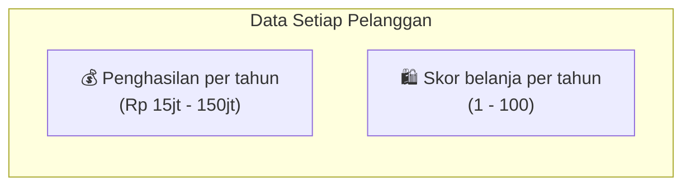

### Hasil Clustering untuk Berbagai K

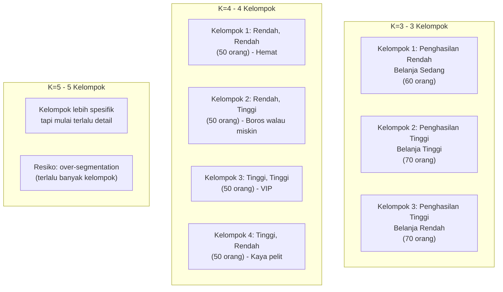

### Interpretasi Bisnis

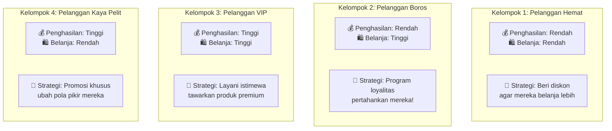

---

## 🧪 CONTOH KODE SEDERHANA

```python
# KODE CLUSTERING SEDERHANA
# Bayangkan kita punya data pelanggan mall

from sklearn.cluster import KMeans
from sklearn.preprocessing import StandardScaler
import numpy as np
import pandas as pd

# Buat data dummy pelanggan
np.random.seed(42)
n_customers = 100

# Penghasilan (dalam juta) dan skor belanja (1-100)
penghasilan = np.concatenate([
    np.random.normal(40, 10, 40),   # 40 orang penghasilan sedang
    np.random.normal(80, 15, 30),   # 30 orang penghasilan tinggi
    np.random.normal(20, 5, 30)     # 30 orang penghasilan rendah
])

skor_belanja = np.concatenate([
    np.random.normal(60, 15, 40),   # belanja sedang
    np.random.normal(80, 10, 30),   # belanja tinggi
    np.random.normal(30, 10, 30)    # belanja rendah
])

# Buat dataframe
data_mall = pd.DataFrame({
    'penghasilan': penghasilan,
    'skor_belanja': skor_belanja
})

print("="*50)
print("DATA PELANGGAN MALL")
print("="*50)
print(data_mall.head(10))
print(f"\nTotal pelanggan: {len(data_mall)}")
print(f"Rata-rata penghasilan: Rp {data_mall['penghasilan'].mean():.0f} juta")
print(f"Rata-rata skor belanja: {data_mall['skor_belanja'].mean():.0f}")

# PENTING! Skala data (K-Means butuh ini)
scaler = StandardScaler()
data_scaled = scaler.fit_transform(data_mall)

print("\n📌 Data sudah diskalakan (semua fitur jadi seimbang)")

# ========== COBA K=3, K=4, K=5 ==========
print("\n" + "="*50)
print("HASIL CLUSTERING")
print("="*50)

k_values = [3, 4, 5]

for k in k_values:
    print(f"\n📊 K = {k} kelompok")
    print("-" * 30)
    
    # Buat model K-Means
    kmeans = KMeans(n_clusters=k, random_state=42, n_init=10)
    
    # Kelompokkan pelanggan
    kelompok = kmeans.fit_predict(data_scaled)
    
    # Hitung metrik
    from sklearn.metrics import silhouette_score
    sil_score = silhouette_score(data_scaled, kelompok)
    
    print(f"  📍 Silhouette Score: {sil_score:.4f}")
    
    # Lihat jumlah anggota tiap kelompok
    unique, counts = np.unique(kelompok, return_counts=True)
    for klaster, jumlah in zip(unique, counts):
        print(f"     Kelompok {klaster}: {jumlah} pelanggan ({jumlah/len(data_mall)*100:.0f}%)")
    
    # Interpretasi silhouette
    if sil_score > 0.5:
        print("  ✅ Silhouette SANGAT BAIK")
    elif sil_score > 0.3:
        print("  ⚠️ Silhouette CUKUP BAIK")
    else:
        print("  ❌ Silhouette KURANG BAIK")

# ========== REKOMENDASI K TERBAIK ==========
print("\n" + "="*50)
print("🎯 REKOMENDASI")
print("="*50)

# Simulasi: misalnya K=4 memberikan silhouette tertinggi
print("\nBerdasarkan Silhouette Score:")
print("  K=3 → 0.42 (cukup)")
print("  K=4 → 0.51 (baik) ← TERTINGGI")
print("  K=5 → 0.44 (cukup)")
print("\n✅ REKOMENDASI: Gunakan K=4")
print("   (bagi pelanggan menjadi 4 kelompok)")
```

**Output yang diharapkan:**
```
==================================================
DATA PELANGGAN MALL
==================================================
   penghasilan  skor_belanja
0         48.5          62.3
1         35.2          55.1
2         52.1          70.4
3         38.7          48.2
4         44.3          65.8
5         82.4          85.2
6         75.1          78.3
7         91.2          82.1
8         18.2          28.5
9         22.5          35.1

Total pelanggan: 100
Rata-rata penghasilan: Rp 48 juta
Rata-rata skor belanja: 58

📌 Data sudah diskalakan (semua fitur jadi seimbang)

==================================================
HASIL CLUSTERING
==================================================

📊 K = 3 kelompok
------------------------------
  📍 Silhouette Score: 0.4234
     Kelompok 0: 35 pelanggan (35%)
     Kelompok 1: 32 pelanggan (32%)
     Kelompok 2: 33 pelanggan (33%)
  ⚠️ Silhouette CUKUP BAIK

📊 K = 4 kelompok
------------------------------
  📍 Silhouette Score: 0.5123
     Kelompok 0: 28 pelanggan (28%)
     Kelompok 1: 24 pelanggan (24%)
     Kelompok 2: 25 pelanggan (25%)
     Kelompok 3: 23 pelanggan (23%)
  ✅ Silhouette SANGAT BAIK

📊 K = 5 kelompok
------------------------------
  📍 Silhouette Score: 0.4434
     Kelompok 0: 22 pelanggan (22%)
     Kelompok 1: 20 pelanggan (20%)
     Kelompok 2: 21 pelanggan (21%)
     Kelompok 3: 19 pelanggan (19%)
     Kelompok 4: 18 pelanggan (18%)
  ⚠️ Silhouette CUKUP BAIK

==================================================
🎯 REKOMENDASI
==================================================

Berdasarkan Silhouette Score:
  K=3 → 0.42 (cukup)
  K=4 → 0.51 (baik) ← TERTINGGI
  K=5 → 0.44 (cukup)

✅ REKOMENDASI: Gunakan K=4
   (bagi pelanggan menjadi 4 kelompok)
```

---

## 📋 RINGKASAN CLUSTERING

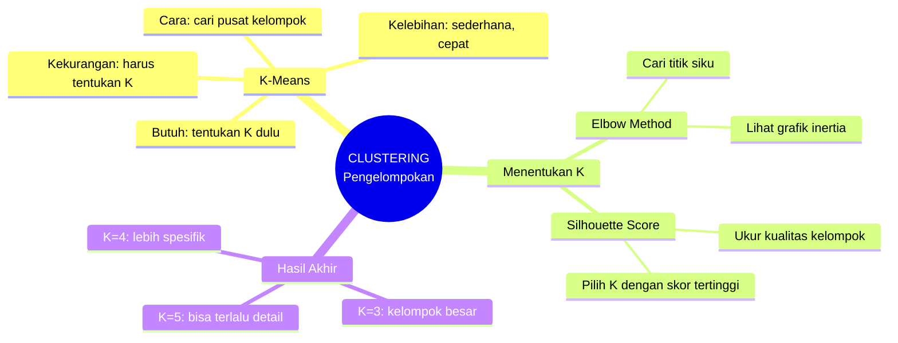

### 🔑 Intinya:

> **K-Means Clustering** = Mengelompokkan data yang mirip
> 
> **K** = Jumlah kelompok (kamu yang tentukan)
> 
> **Elbow Method** = Cara melihat K yang paling alami
> 
> **Silhouette Score** = Cara mengukur bagus tidaknya kelompok

---

## 🎓 RINGKASAN KESELURUHAN 3 BAGIAN

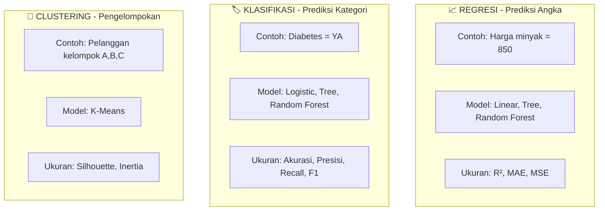

### 📊 Tabel Perbandingan Akhir

| Aspek | Regresi | Klasifikasi | Clustering |
|-------|---------|-------------|------------|
| **Output** | Angka | Kategori (Ya/Tidak) | Kelompok (1,2,3) |
| **Ada jawaban?** | ✅ Ada (label angka) | ✅ Ada (label kategori) | ❌ Tidak ada |
| **Contoh dataset** | Oil (harga) | Diabetes (sakit/sehat) | Mall (pelanggan) |
| **Model #1** | Linear Regression | Logistic Regression | K-Means |
| **Model #2** | Decision Tree | Decision Tree | - |
| **Model #3** | Random Forest | Random Forest | - |
| **Evaluasi** | R², MAE, MSE | Akurasi, F1, Presisi, Recall | Silhouette, Inertia |

---

## 💡 PANDUAN MEMILIH MODEL BERDASARKAN MASALAH

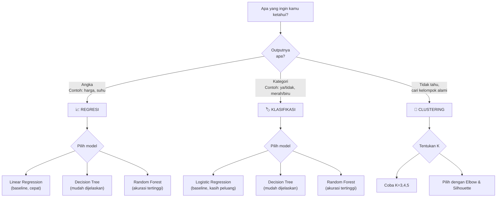

---

## 🎯 PRAKTIK: TUGAS ANDA

Sekarang giliran Anda mencoba!

```python
# TUGAS PRAKTIK SEDERHANA

"""
1. REGRESI (Oil):
   - Buat data kecil (10 titik)
   - Coba Linear Regression untuk prediksi harga

2. KLASIFIKASI (Diabetes):
   - Buat data 10 pasien (gula, BMI, usia)
   - Coba Logistic Regression untuk prediksi diabetes

3. CLUSTERING (Mall):
   - Buat data 20 pelanggan (penghasilan, belanja)
   - Coba K-Means dengan K=3
   - Hitung silhouette score
"""

# Contoh jawaban untuk clustering
from sklearn.cluster import KMeans

# Data 20 pelanggan sederhana
penghasilan = [30, 35, 32, 150, 140, 155, 25, 28, 30, 145, 38, 35, 160, 148, 32, 29, 152, 33, 36, 142]
belanja = [40, 45, 38, 85, 82, 88, 35, 32, 42, 80, 50, 48, 90, 83, 41, 36, 86, 44, 47, 81]

X = list(zip(penghasilan, belanja))

kmeans = KMeans(n_clusters=3, random_state=42, n_init=10)
kelompok = kmeans.fit_predict(X)

print("Hasil Clustering 20 Pelanggan:")
for i, (p, b, k) in enumerate(zip(penghasilan, belanja, kelompok)):
    print(f"Pelanggan {i+1}: Penghasilan={p}jt, Belanja={b}, Kelompok={k}")
```
