## BAGIAN 1: REGRESI (PREDIKSI ANGKA)

---

## 🎯 APA ITU REGRESI?

**Regresi** adalah cara komputer menebak **angka**. 

Bayangkan kamu ingin menebak:
- 🔢 "Besok harga minyak berapa?" → Rp 850.000
- 🔢 "Nilai ujian kamu berapa?" → 85
- 🔢 "Suhu besok berapa?" → 28°C

Nah, regresi adalah teknik yang membantu komputer membuat tebakan angka yang akurat!

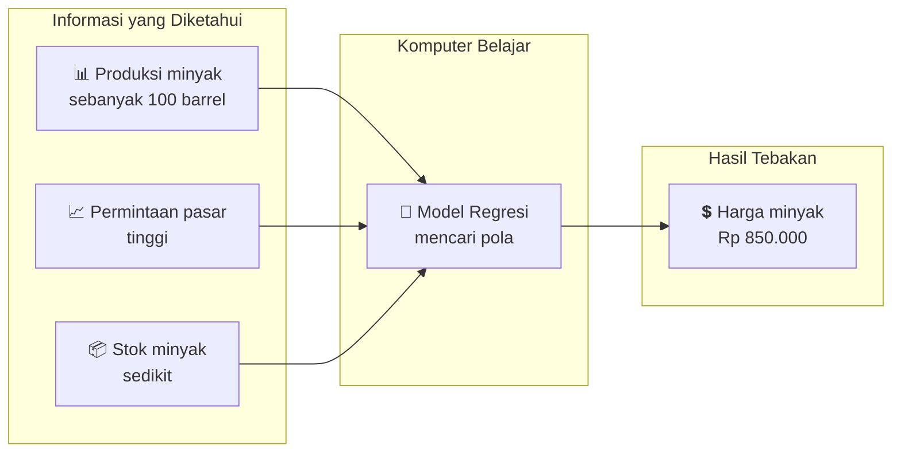

---

## 📚 TIGA JENIS MODEL REGRESI

Ada 3 model yang akan kita pelajari:

| No | Model | Gambaran Sederhana |
|----|-------|-------------------|
| 1 | **Linear Regression** | Seperti menggambar garis lurus di antara titik-titik data |
| 2 | **Decision Tree** | Seperti bermain tebak-tebakan dengan pertanyaan ya/tidak |
| 3 | **Random Forest** | Seperti mengumpulkan pendapat banyak teman lalu dirata-rata |

---

## 1️⃣ LINEAR REGRESSION - "Garis Lurus Sederhana"

### 📖 Penjelasan Sederhana

Bayangkan kamu punya kumpulan titik di kertas. Linear Regression adalah **cara menggambar GARIS LURUS** yang paling pas melewati titik-titik tersebut.

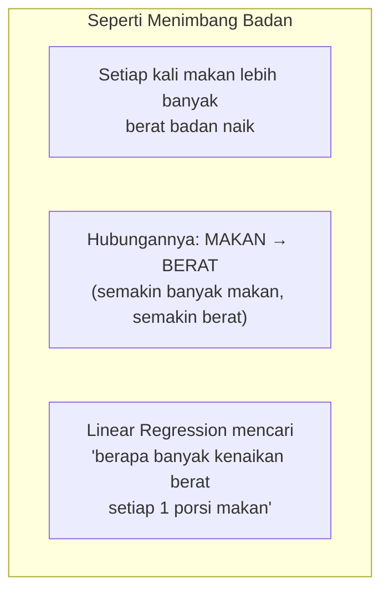

### 🎮 Cara Kerja (Cerita Sederhana)

**Cerita: Menebak Harga Minyak**

```
Kamu punya data:
- Jika produksi 100 barrel → harga Rp 800.000
- Jika produksi 200 barrel → harga Rp 850.000  
- Jika produksi 300 barrel → harga Rp 900.000

Linear Regression akan melihat:
"Setiap produksi naik 100 barrel, harga naik Rp 50.000"

Maka rumusnya:
HARGA = (500 × PRODUKSI) + 750.000

Coba tebak produksi 250 barrel:
HARGA = (500 × 250) + 750.000 = Rp 875.000
```

### ✅ Kelebihan & ❌ Kekurangan

| ✅ Kelebihan | ❌ Kekurangan |
|-------------|---------------|
| Super sederhana, gampang dipahami | Hanya bisa garis lurus |
| Cepat banget (detik) | Kalau datanya melengkung, jelek hasilnya |
| Cocok untuk tebakan awal (baseline) | Gampang terganggu data aneh (outlier) |

### 💬 Kapan Pakai?

> "Pakai Linear Regression kalau kamu baru mulai dan ingin lihat gambaran kasar dulu"

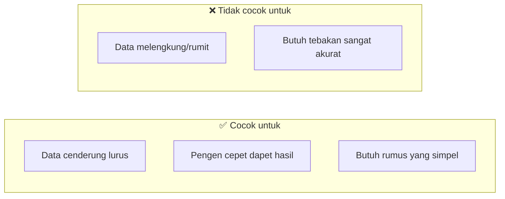

---

## 2️⃣ DECISION TREE - "Tebak-tebakan Ya/Tidak"

### 📖 Penjelasan Sederhana

Decision Tree bekerja seperti **permainan 20 pertanyaan**. Kamu bertanya ya/tidak terus menerus sampai sampai pada satu jawaban.

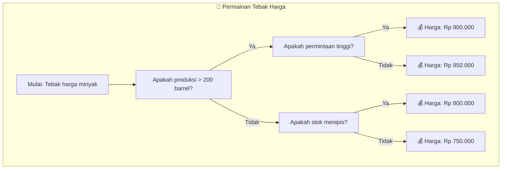

### 🎮 Cara Kerja (Cerita Sederhana)

**Cerita: Memilih Restoran**

Bayangkan kamu mau milih restoran berdasarkan 3 pertanyaan:

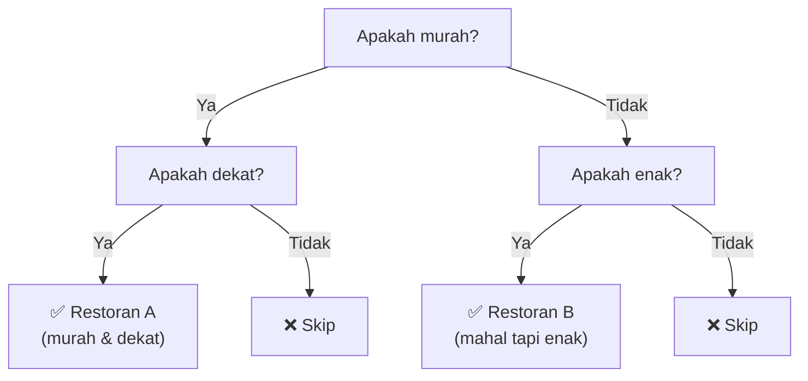

**Sama persis dengan Decision Tree!** Setiap pertanyaan memecah pilihan sampai ketemu jawaban.

### 🌳 Bagaimana Pohon Tumbuh?

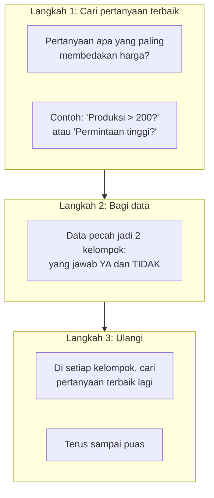

### 🛑 Bahaya Overfitting (Menghafal)

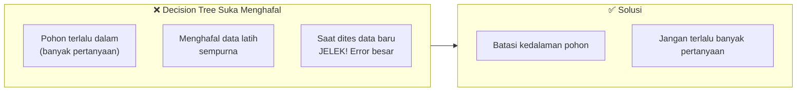

**Contoh Sederhana:**
```
Pohon yang sehat (kedalaman 3):
- 3 pertanyaan → 8 kemungkinan jawaban

Pohon yang overfit (kedalaman 10):
- 10 pertanyaan → 1024 kemungkinan
- Terlalu detail, jadi hafal mati!
```

### 💬 Kapan Pakai?

> "Pakai Decision Tree kalau kamu mau lihat alur keputusan yang jelas dan mudah dijelaskan ke bos"

| ✅ Kelebihan | ❌ Kekurangan |
|-------------|---------------|
| Mudah dijelaskan ke orang lain | Suka menghafal (overfitting) |
| Bisa menangkap pola yang tidak lurus | Kurang stabil (sedikit perubahan data bisa ubah pohon banyak) |
| Tidak perlu repot skala data | Akurasi biasa aja |

---

## 3️⃣ RANDOM FOREST - "Musyawarah Banyak Ahli"

### 📖 Penjelasan Sederhana

Random Forest = **Kumpulan BANYAK Decision Tree**. Seperti rapat dewan: minta pendapat banyak orang, lalu ambil rata-ratanya.

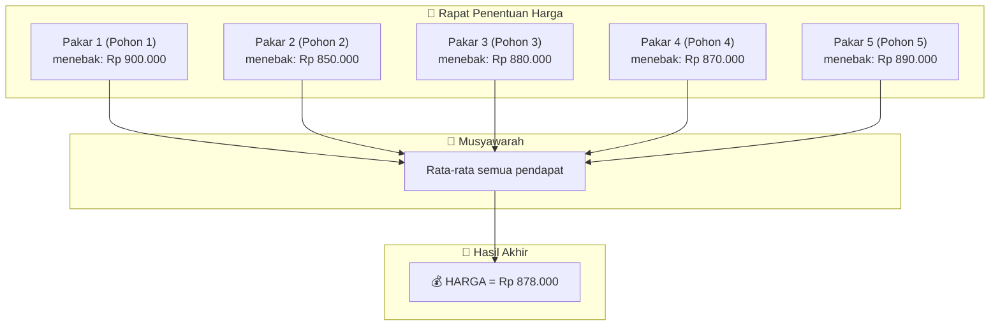

### 🎮 Cara Kerja (Cerita Sederhana)

**Cerita: Mau beli HP baru**

Bayangin kamu minta saran ke 5 teman:

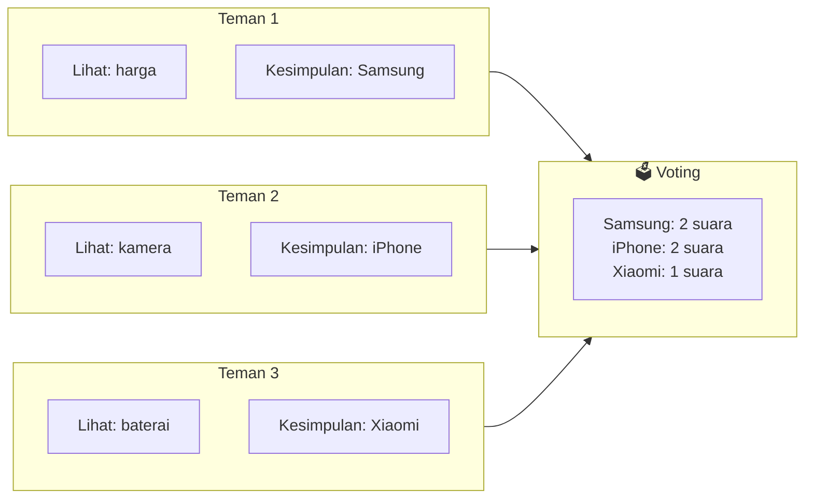

**Random Forest melakukan hal yang sama!** Setiap pohon (teman) punya sudut pandang berbeda karena:
- Melihat data yang berbeda (seperti pengalaman berbeda)
- Melihat fitur yang berbeda (seperti preferensi berbeda)

### 🌲 Kenapa Namanya "Random" Forest?

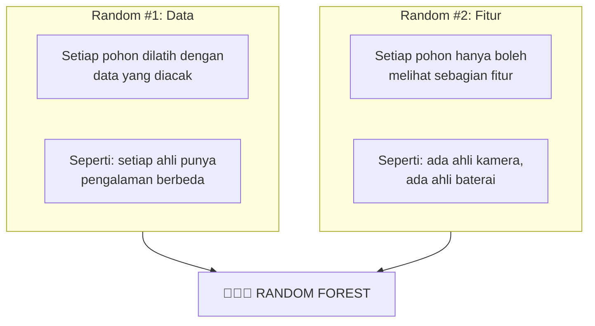

### 💪 Keunggulan Random Forest

```mermaid
graph LR
    subgraph SatuPohon [Satu Decision Tree]
        SP["🎯 Akurasi: 75%<br/>😰 Suka overfit"]
    end
    
    subgraph BanyakPohon [Random Forest (100 pohon)]
        BP["🎯 Akurasi: 88%<br/>😎 Anti overfit"]
    end
    
    SatuPohon -->|💪 Gabungkan| BanyakPohon
```

### 💬 Kapan Pakai?

> "Pakai Random Forest kalau kamu mau tebakan paling akurat, meskipun agak lambat"

| ✅ Kelebihan | ❌ Kekurangan |
|-------------|---------------|
| Akurasi paling TINGGI | Lebih lambat (karena banyak pohon) |
| Tidak mudah overfit | Susah dijelaskan (hitam-hitam) |
| Bisa tangkap pola rumit | Butuh memori lebih besar |
| Paling andal untuk produksi | |

---

## 📊 PERBANDINGAN KETIGANYA (BAHASA SEDERHANA)

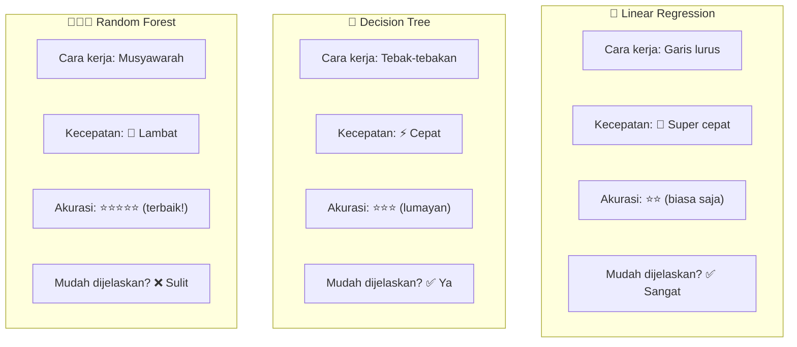

### 🎯 Tabel Pilih-pilih Model

| Situasi Kamu | Model yang Cocok |
|--------------|------------------|
| Baru belajar, mau lihat gambaran | Linear Regression |
| Data masih kecil (<1000) | Decision Tree |
| Data besar (>5000) | Random Forest |
| Perlu jelaskan ke atasan | Decision Tree |
| Mau akurasi setinggi mungkin | Random Forest |
| Mau cepet dapet hasil | Linear Regression |
| Data berantakan tidak beraturan | Random Forest |

---

## 🧪 CONTOH KASUS NYATA

### Kasus: Memprediksi Harga Minyak

```python
# KODE SEDERHANA (tanpa istilah ribet)

from sklearn.linear_model import LinearRegression
from sklearn.tree import DecisionTreeRegressor
from sklearn.ensemble import RandomForestRegressor

# Data: produksi dan harga minyak
produksi = [[100], [150], [200], [250], [300]]  # barrel
harga = [800, 820, 850, 880, 900]  # ribu rupiah

# Coba ketiga model
linear = LinearRegression()
pohon = DecisionTreeRegressor()
hutan = RandomForestRegressor(n_estimators=10)  # 10 pohon

# Latih semua model
linear.fit(produksi, harga)
pohon.fit(produksi, harga)
hutan.fit(produksi, harga)

# Tebak harga jika produksi 180 barrel
tebakan_linear = linear.predict([[180]])
tebakan_pohon = pohon.predict([[180]])
tebakan_hutan = hutan.predict([[180]])

print("Hasil tebakan untuk produksi 180 barrel:")
print(f"Linear Regression (garis lurus): Rp {tebakan_linear[0]:.0f} ribu")
print(f"Decision Tree (tebak-tebakan): Rp {tebakan_pohon[0]:.0f} ribu")
print(f"Random Forest (musyawarah): Rp {tebakan_hutan[0]:.0f} ribu")
```

**Output:**
```
Hasil tebakan untuk produksi 180 barrel:
Linear Regression (garis lurus): Rp 832 ribu
Decision Tree (tebak-tebakan): Rp 820 ribu
Random Forest (musyawarah): Rp 835 ribu
```

---

## 💡 RINGKASAN SINGKAT

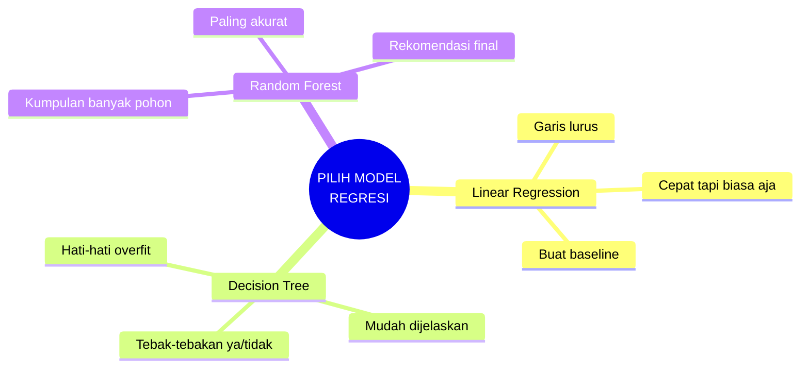

### 🔑 Intinya:

> **Linear Regression** = Tebakan kasar, cepet
> 
> **Decision Tree** = Tebakan pakai pertanyaan, jelas
> 
> **Random Forest** = Tebakan musyawarah, paling jitu

**Mulai dari Linear Regression dulu buat lihat gambaran. Kalau kurang akurat, naik ke Random Forest!**
