# Sesi 1: Fundamental AI dan Roadmap Karir

## 1.1 Apa itu AI, Machine Learning, Deep Learning?

### Definisi dan Hierarki AI → ML → DL

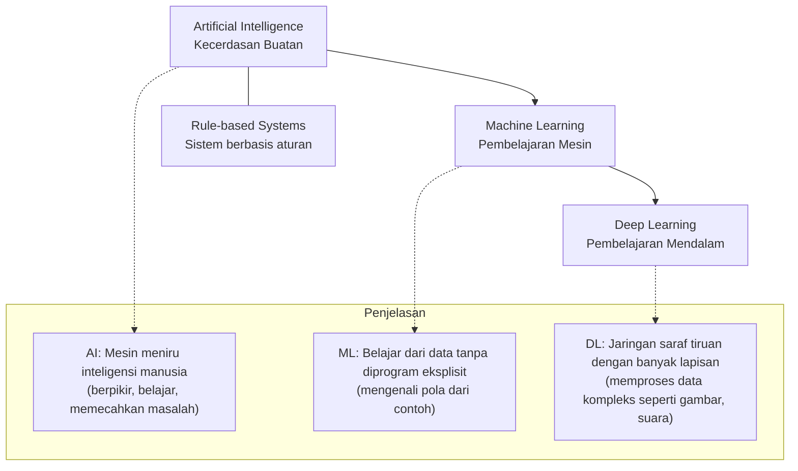

**Penjelasan Hierarki:**
- **AI (Artificial Intelligence)** : Payung terbesar - semua upaya membuat mesin cerdas
- **ML (Machine Learning)** : Subset AI - mesin belajar dari data
- **DL (Deep Learning)** : Subset ML - menggunakan neural network berlapis-lapis

**Sumber:**
- Russell, S., & Norvig, P. (2020). *Artificial Intelligence: A Modern Approach*. Pearson.
- Goodfellow, I., et al. (2016). *Deep Learning*. MIT Press.

---

### Perbedaan dengan Pemrograman Tradisional (Rule-based vs Data-driven)

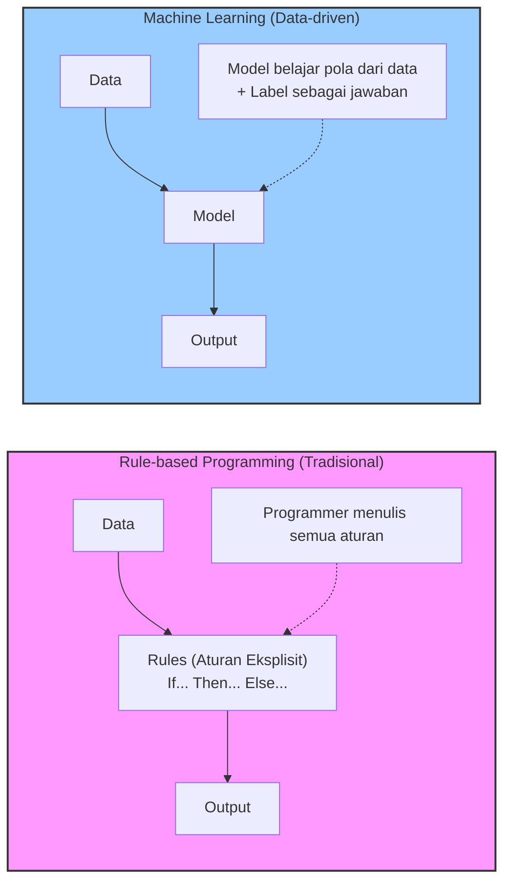

| Aspek | Rule-based | Data-driven (ML) |
|-------|-----------|------------------|
| **Pendekatan** | Programmer menulis aturan | Model belajar dari contoh |
| **Adaptasi** | Perlu update manual aturan | Belajar otomatis dari data baru |
| **Kompleksitas** | Terbatas pada kemampuan programmer | Dapat menangani pola kompleks |
| **Contoh** | Sistem pakar, kalkulator, lampu lalu lintas | Pengenalan wajah, NLP, rekomendasi |
| **Performa pada data besar** | Menurun (aturan terlalu banyak) | Meningkat (semakin banyak data semakin baik) |

**Sumber:** Chollet, F. (2018). *Deep Learning with Python*. Manning.

---

### Contoh Aplikasi Sehari-hari

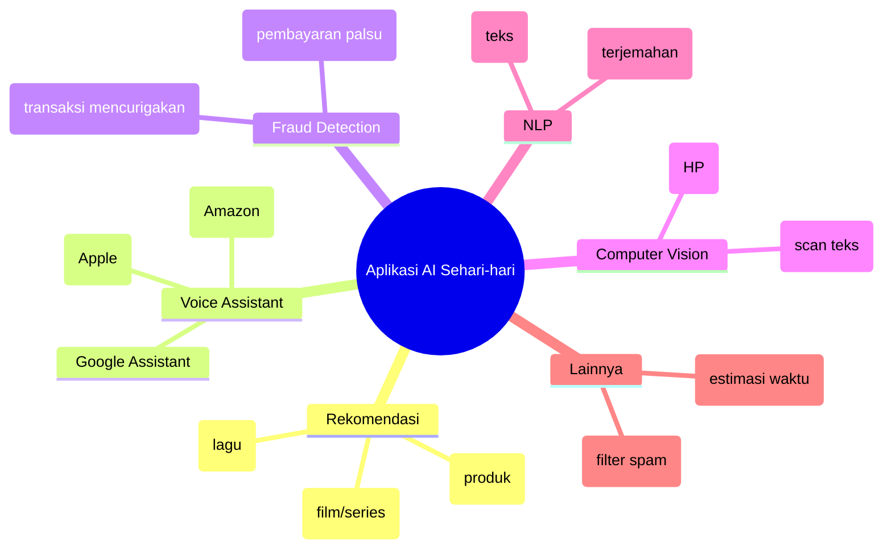

**Sumber:** https://ai.googleblog.com/ , https://netflixtechblog.com/

---

## 1.2 Tiga Jenis Machine Learning (Fokus ke Dataset)

### Perbedaan Klasifikasi, Regresi, dan Pengelompokan (Clustering)

Berdasarkan gambar dari [Mercubuana Yogya](https://imam.mercubuana-yogya.ac.id/wp-content/uploads/2024/11/img.197Jenis-jenis-utama-Machine-Learning-Pembelajaran-Mesin.jpg), ketiga metode ini memiliki perbedaan fundamental:

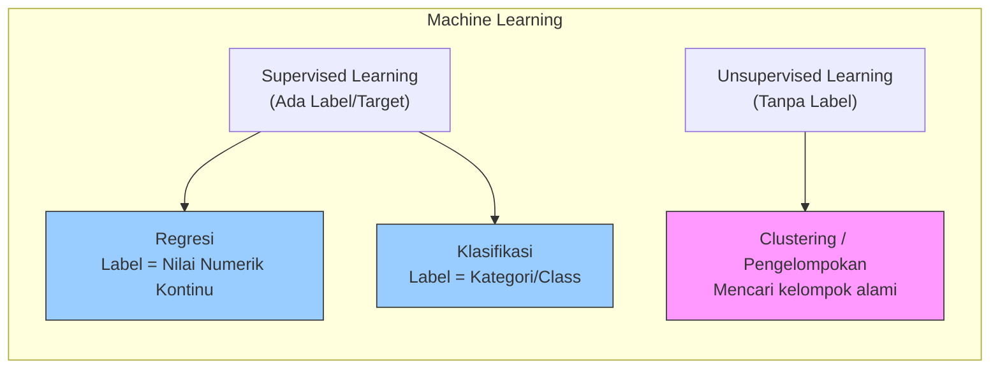

### Tabel Perbandingan Utama

| Aspek | **Regresi** | **Klasifikasi** | **Pengelompokan (Clustering)** |
|-------|-------------|----------------|-------------------------------|
| **Tipe Pembelajaran** | Supervised | Supervised | Unsupervised |
| **Label/Target** | Ada (numeric/angka) | Ada (kategori) | Tidak ada |
| **Output** | Nilai kontinu (contoh: 150.000, 37.5°C) | Kelas diskrit (contoh: "sakit", "sehat") | Kelompok alami (cluster) |
| **Contoh Pertanyaan** | "Berapa banyak?" "Seberapa besar?" | "Apakah termasuk kategori A atau B?" | "Bagaimana data ini mengelompok?" |
| **Evaluasi** | MAE, RMSE, R² | Accuracy, Precision, Recall, F1 | Silhouette Score, Inertia |

---

### Penjelasan Detail per Metode

#### 1. Regresi (Regression) - Memprediksi Nilai Numerik

**Definisi:** Memprediksi *output berupa angka kontinu* berdasarkan data input. Label adalah nilai numerik.

**Contoh dari referensi gambar:**
> *"Predict the number of ice creams sold based on day, season, and weather"*

**Penjelasan:** Kita ingin memprediksi **berapa banyak** es krim terjual (nilai: 50, 127, 300, dst.), bukan hanya "laku" atau "tidak laku".

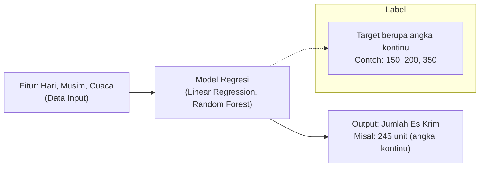

**Karakteristik Regresi:**
- Output tidak terbatas pada nilai diskrit (bisa 150.5, 200.75, dst.)
- Mencari hubungan fungsional antara input dan output
- Contoh lain: prediksi harga rumah, suhu besok, pendapatan perusahaan

---

#### 2. Klasifikasi (Classification) - Memprediksi Kategori

**Definisi:** Memprediksi *output berupa kategori/kelas* berdasarkan data input. Label adalah kelas diskrit.

**Contoh dari referensi gambar:**

> *"Predict whether a patient is at-risk for diabetes based on clinical data"*

**Penjelasan:** Outputnya adalah **kategori** (berisiko diabetes atau tidak) - hanya dua kemungkinan = **Binary Classification**.

> *"Predict the species of a penguin based on its measurements"*

**Penjelasan:** Outputnya adalah **salah satu dari beberapa spesies** (Gentoo, Adelie, Chinstrap) - ini adalah **Multiclass Classification**.

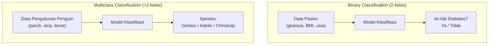

**Karakteristik Klasifikasi:**
- Output bersifat kualitatif/kategorikal
- Dua jenis utama:
  - **Binary classification** (2 kelas, misal: spam/bukan spam, sehat/sakit)
  - **Multiclass classification** (lebih dari 2 kelas, misal: jenis bunga iris, merek mobil)

---

#### 3. Pengelompokan (Clustering) - Mencari Kelompok Alami Tanpa Label

**Definisi:** Mengelompokkan data ke dalam *cluster* (kelompok) di mana anggota dalam satu kelompok memiliki kemiripan, **tanpa** menggunakan label yang sudah diketahui sebelumnya.

**Contoh dari referensi gambar:**
> *"Separate plants into groups based on common characteristics"*

**Penjelasan:** Tidak ada label "jenis tanaman A/B/C" yang disediakan. Algoritma akan mencari pola alami dalam data (misal: berdasarkan tinggi, warna daun, kebutuhan air) dan membentuk kelompok sendiri.

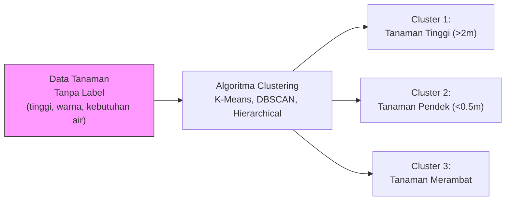

**Karakteristik Clustering:**
- Data **tanpa label** (unsupervised learning)
- Tujuan: eksplorasi data, segmentasi, menemukan struktur tersembunyi
- Contoh lain: segmentasi pelanggan toko online, pengelompokan berita, analisis gen

---

### Visualisasi Perbandingan Konseptual (2D)

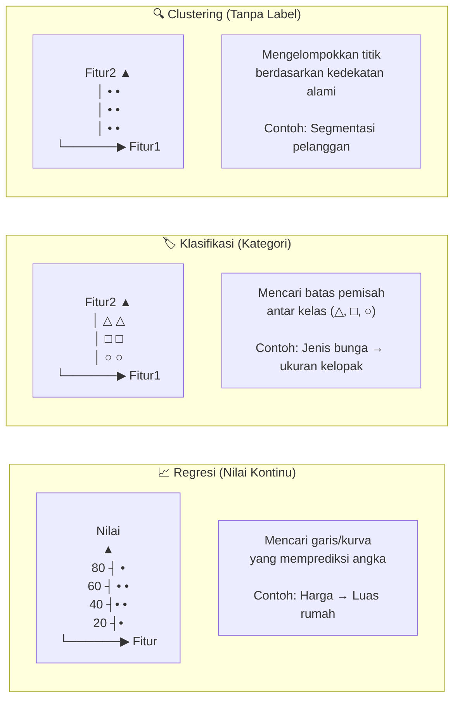

---

### Kapan Menggunakan Masing-masing Jenis? (Decision Tree)

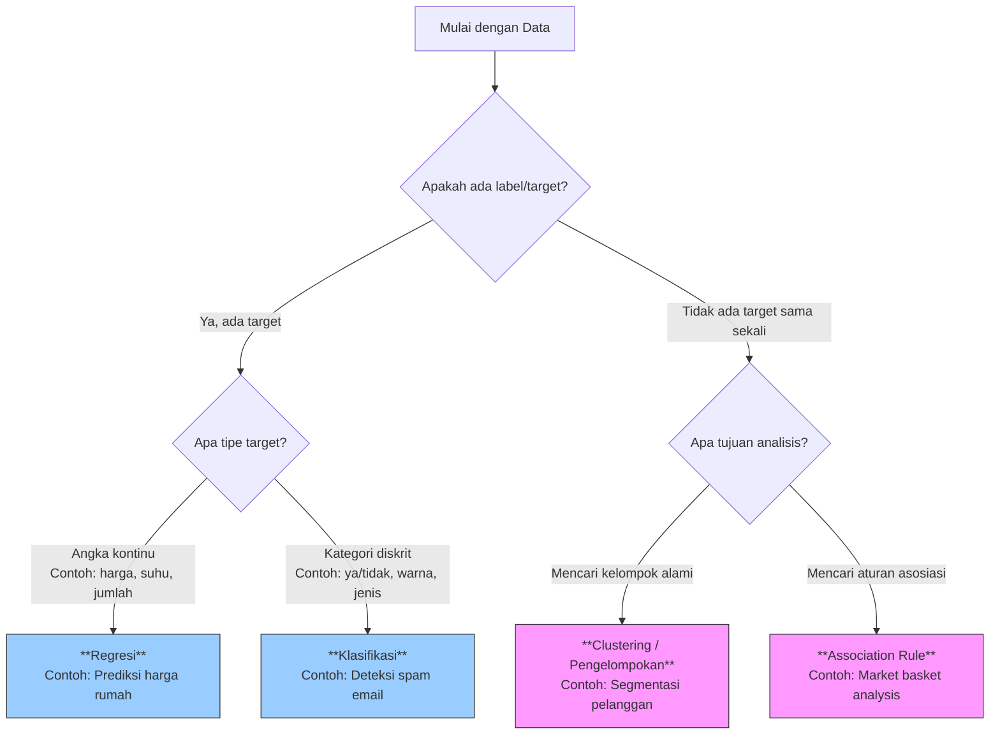

**Sumber:**
- James, G., et al. (2021). *An Introduction to Statistical Learning*. Springer.
- Murphy, K. P. (2022). *Probabilistic Machine Learning*. MIT Press.
- Gambar referensi: [Mercubuana Yogya](https://imam.mercubuana-yogya.ac.id/wp-content/uploads/2024/11/img.197Jenis-jenis-utama-Machine-Learning-Pembelajaran-Mesin.jpg)

---

## 1.3 Studi Kasus dari Repository

### Ringkasan Tiga Studi Kasus

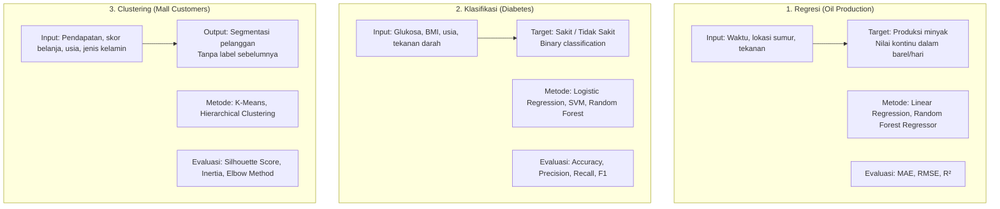

### Detail Dataset dan Implementasi

| Studi Kasus | Jenis | Dataset Source | Jumlah Data | Fitur Utama | Metrik Evaluasi |
|-------------|-------|----------------|-------------|-------------|-----------------|
| **Oil Production** | Regresi | [Oil Dataset](https://www.kaggle.com/datasets) | ±1000 baris | Waktu, tekanan, suhu, lokasi | MAE, RMSE, R² |
| **Diabetes** | Klasifikasi | [PIMA Indian Diabetes](https://www.kaggle.com/datasets/uciml/pima-indians-diabetes-database) | 768 baris | Glukosa, BMI, usia, kehamilan | Accuracy, Precision, Recall, F1, AUC |
| **Mall Customers** | Clustering | [Mall Customer Data](https://www.kaggle.com/datasets/vjchoudhary7/customer-segmentation-tutorial-in-python) | 200 baris | Pendapatan tahunan, skor belanja | Silhouette Score, Inertia |

### Contoh Implementasi Sederhana (Pseudocode)

```python
# 1. REGRESI - Prediksi Produksi Minyak
from sklearn.linear_model import LinearRegression
model_reg = LinearRegression()
model_reg.fit(X_train, y_train)  # y_train = produksi minyak (angka)
prediksi = model_reg.predict(X_test)  # output: 1250.5 barel

# 2. KLASIFIKASI - Deteksi Diabetes
from sklearn.ensemble import RandomForestClassifier
model_clf = RandomForestClassifier()
model_clf.fit(X_train, y_train)  # y_train = 0 (sehat) atau 1 (diabetes)
prediksi = model_clf.predict(X_test)  # output: 0 atau 1

# 3. CLUSTERING - Segmentasi Pelanggan
from sklearn.cluster import KMeans
model_clust = KMeans(n_clusters=5)
model_clust.fit(X)  # X tanpa label!
segment = model_clust.predict(X)  # output: 0,1,2,3,4 (nomor cluster)
```

**Sumber Dataset:**
- Kaggle: https://www.kaggle.com/
- UCI Machine Learning Repository: https://archive.ics.uci.edu/
- Scikit-learn datasets: https://scikit-learn.org/stable/datasets.html

---

## 1.4 Roadmap Karir AI Engineer

### Perbandingan Role: AI Engineer vs Data Scientist vs ML Engineer vs Data Analyst

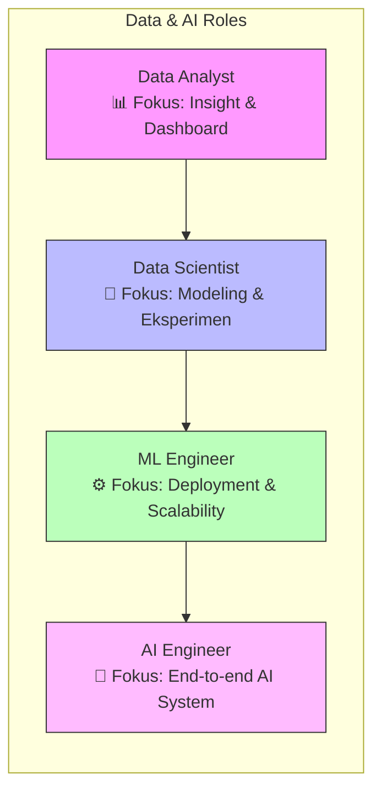

### Tabel Perbandingan Detail

| Role | Tanggung Jawab Utama | Tools Utama | Gaji Rata-rata (IDR/USD) |
|------|---------------------|-------------|--------------------------|
| **Data Analyst** | Visualisasi data, Dashboard, SQL queries, Laporan bisnis | Tableau, Power BI, SQL, Excel | Rp 8-15 juta / $4k-6k |
| **Data Scientist** | Eksperimen model, Feature engineering, A/B testing, Statistika | Python, R, scikit-learn, Jupyter | Rp 15-30 juta / $8k-12k |
| **ML Engineer** | Deployment model, CI/CD pipeline, Monitoring, Scalability | Docker, Kubernetes, MLflow, TF Serving | Rp 20-40 juta / $10k-15k |
| **AI Engineer** | End-to-end pipeline, Optimization, System design, MLOps | TensorFlow, PyTorch, Airflow, Kubeflow | Rp 25-50 juta / $12k-18k |

**Sumber:** Glassdoor, Indeed, LinkedIn Salary (2024)

---

### Skill Tree AI Engineer

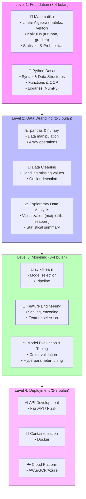

---

### Sertifikasi Relevan

| Sertifikasi | Provider | Tingkat | Harga (USD) | Waktu Persiapan |
|-------------|----------|---------|-------------|-----------------|
| **TensorFlow Developer Certificate** | Google | Intermediate | $100 | 1-2 bulan |
| **AWS Certified Machine Learning - Specialty** | Amazon | Advanced | $300 | 2-3 bulan |
| **Databricks ML Associate** | Databricks | Intermediate | $200 | 1-2 bulan |
| **Azure Data Scientist Associate** | Microsoft | Intermediate | $165 | 1-2 bulan |
| **Deep Learning Specialization** | DeepLearning.AI | Beginner-Intermediate | $49/bulan | 2-3 bulan |

**Sumber:**
- TensorFlow: https://www.tensorflow.org/certificate
- AWS ML: https://aws.amazon.com/certification/certified-machine-learning-specialty/
- Databricks: https://www.databricks.com/learn/certification

---

### Portofolio yang Menarik Recruiter

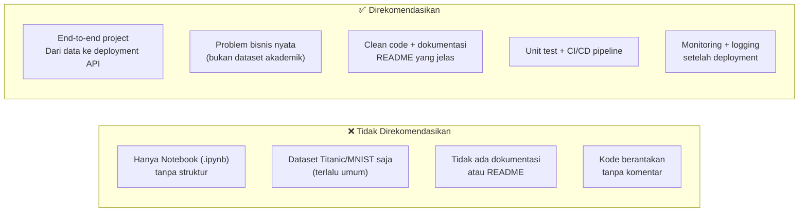

### Checklist Portofolio End-to-End

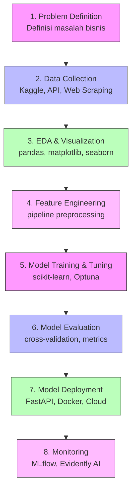

**Sumber:** Data Science Portfolio Guide - https://github.com/DataSciencePortfolio

---

## 1.5 Setup Environment

### Arsitektur Setup

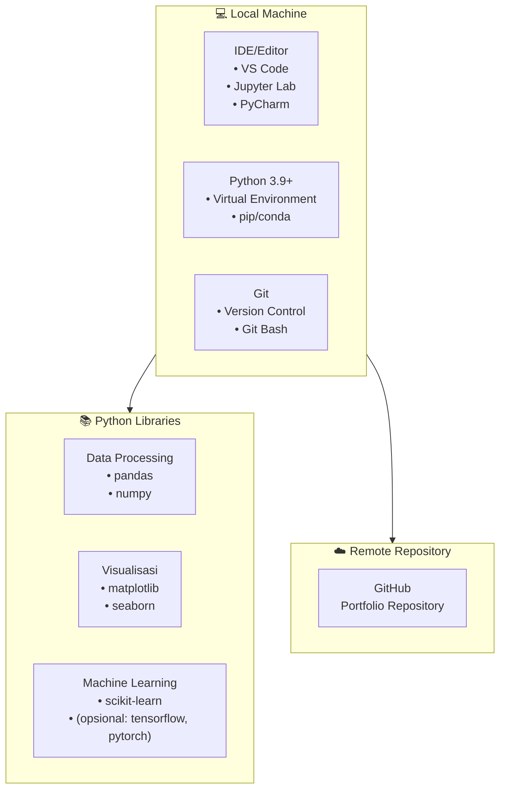

### Langkah Instalasi (Lengkap)

```bash
# ============================================
# 1. INSTALL PYTHON
# ============================================
# Windows: Download dari https://www.python.org/downloads/
# Mac: brew install python@3.9
# Linux: sudo apt install python3.9 python3-pip

# ============================================
# 2. INSTALL VS CODE (Opsional, tapi direkomendasikan)
# ============================================
# Download dari: https://code.visualstudio.com/
# Ekstensi yang diinstall:
#   - Python (Microsoft)
#   - Jupyter
#   - GitLens
#   - Prettier

# ============================================
# 3. BUAT VIRTUAL ENVIRONMENT
# ============================================
# Membuat environment baru
python -m venv ai_env

# Aktivasi (Mac/Linux)
source ai_env/bin/activate

# Aktivasi (Windows)
# ai_env\Scripts\activate

# ============================================
# 4. INSTALL LIBRARIES
# ============================================
# Core libraries
pip install pandas numpy matplotlib seaborn scikit-learn

# Additional (opsional untuk development)
pip install jupyter notebook ipykernel black flake8

# Untuk deep learning (opsional, butuh resource besar)
# pip install tensorflow pytorch

# ============================================
# 5. VERIFIKASI INSTALASI
# ============================================
python -c "import pandas as pd; import numpy as np; import sklearn; print(f'pandas: {pd.__version__}'); print(f'numpy: {np.__version__}'); print(f'sklearn: {sklearn.__version__}'); print('✅ Setup berhasil!')"

# ============================================
# 6. INSTALL GIT
# ============================================
# Download dari: https://git-scm.com/
# Konfigurasi awal:
git config --global user.name "Nama Kamu"
git config --global user.email "email@kamu.com"
```

---

### Create GitHub Repository untuk Portofolio

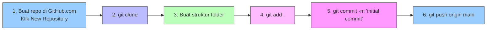

### Struktur Portofolio yang Direkomendasikan

```
portfolio-ai/
│
├── README.md                          # Dokumentasi utama portfolio
├── requirements.txt                   # Daftar library yang digunakan
├── .gitignore                         # File yang tidak perlu di-commit
│
├── notebooks/                         # Jupyter notebooks untuk eksplorasi
│   ├── 01_oil_regression.ipynb       # Studi kasus regresi
│   ├── 02_diabetes_classification.ipynb  # Studi kasus klasifikasi
│   └── 03_mall_clustering.ipynb      # Studi kasus clustering
│
├── src/                               # Source code moduler
│   ├── __init__.py
│   ├── data_preprocessing.py         # Fungsi preprocessing
│   ├── models.py                     # Definisi model
│   └── utils.py                      # Utility functions
│
├── data/                              # Dataset (jangan di-commit jika besar)
│   ├── raw/                          # Data mentah
│   └── processed/                    # Data yang sudah diproses
│
├── deployment/                        # Kode untuk deployment
│   ├── app.py                        # FastAPI/Flask app
│   ├── Dockerfile                    # Docker configuration
│   └── requirements_deploy.txt       # Requirements khusus deployment
│
├── tests/                             # Unit testing
│   ├── test_preprocessing.py
│   └── test_models.py
│
├── docs/                              # Dokumentasi tambahan
│   └── project_report.pdf
│
└── .github/                           # GitHub Actions (CI/CD)
    └── workflows/
        └── ci.yml
```

### Contoh .gitignore untuk Proyek AI

```gitignore
# Python
__pycache__/
*.py[cod]
*.so
.Python

# Virtual Environment
venv/
env/
ai_env/

# Jupyter Notebook
.ipynb_checkpoints/
*.ipynb~

# Data files (besar)
*.csv
*.pkl
*.h5
*.parquet
data/raw/
data/processed/

# Environment variables
.env
.env.local

# IDE
.vscode/
.idea/

# Model files (besar)
*.joblib
*.pkl
models/
```

### Contoh README.md untuk Portofolio

```markdown
# AI Portfolio - [Nama Kamu]

## Tentang Saya
Data Scientist/AI Engineer dengan fokus pada [bidang spesialisasi].

## Proyek Unggulan

### 1. Prediksi Produksi Minyak (Regresi)
- **Dataset**: Oil production data
- **Metode**: Random Forest Regressor
- **Hasil**: R² = 0.89, RMSE = 125 barel
- **[Link ke notebook](notebooks/01_oil_regression.ipynb)**

### 2. Deteksi Diabetes (Klasifikasi)
- **Dataset**: PIMA Indian Diabetes
- **Metode**: Logistic Regression, Random Forest
- **Hasil**: Accuracy 85%, F1-score 0.82
- **[Link ke notebook](notebooks/02_diabetes_classification.ipynb)**

### 3. Segmentasi Pelanggan Mall (Clustering)
- **Dataset**: Mall customer data
- **Metode**: K-Means
- **Hasil**: 5 segmen optimal dengan silhouette score 0.55
- **[Link ke notebook](notebooks/03_mall_clustering.ipynb)**

## Skills
- Python, pandas, numpy, scikit-learn
- Data visualization (matplotlib, seaborn)
- Git, GitHub

## Kontak
- LinkedIn: [link]
- Email: [email]
- GitHub: [username]
```

---

## Ringkasan Akhir Sesi 1

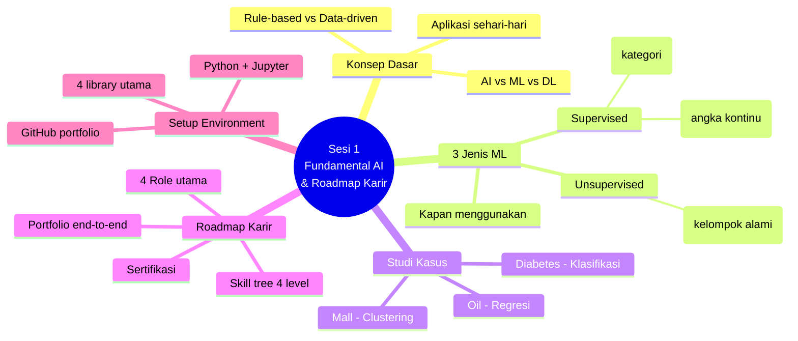

---

## Tugas Praktik Sesi 1

### Tugas Wajib
1. **Install** semua tools yang disebutkan di bagian 1.5
2. **Buat repository** GitHub dengan nama `ai-portfolio-[namamu]`
3. **Clone** repository tersebut ke lokal
4. **Buat virtual environment** dan install library yang diperlukan
5. **Buat notebook sederhana** yang menampilkan:
   - Load dataset (gunakan seaborn bawaan: `load_dataset('tips')`)
   - EDA sederhana (info, describe, histogram)
   - Simpan ke repository dan push ke GitHub

---

## Daftar Pustaka Lengkap

1. Russell, S., & Norvig, P. (2020). *Artificial Intelligence: A Modern Approach*. Pearson.
2. Goodfellow, I., Bengio, Y., & Courville, A. (2016). *Deep Learning*. MIT Press.
3. James, G., Witten, D., Hastie, T., & Tibshirani, R. (2021). *An Introduction to Statistical Learning*. Springer.
4. Chollet, F. (2018). *Deep Learning with Python*. Manning.
5. Murphy, K. P. (2022). *Probabilistic Machine Learning: An Introduction*. MIT Press.
6. Géron, A. (2022). *Hands-On Machine Learning with Scikit-Learn, Keras & TensorFlow*. O'Reilly.
7. VanderPlas, J. (2016). *Python Data Science Handbook*. O'Reilly.
8. Gambar referensi: [Mercubuana Yogya](https://imam.mercubuana-yogya.ac.id/wp-content/uploads/2024/11/img.197Jenis-jenis-utama-Machine-Learning-Pembelajaran-Mesin.jpg)
9. Kaggle Datasets: https://www.kaggle.com/
10. UCI Machine Learning Repository: https://archive.ics.uci.edu/

---
