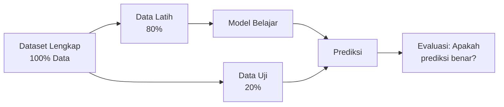
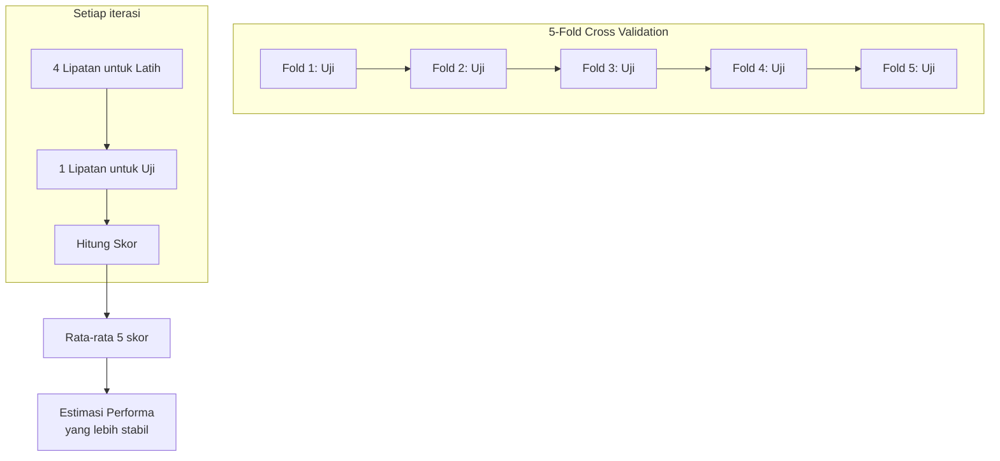
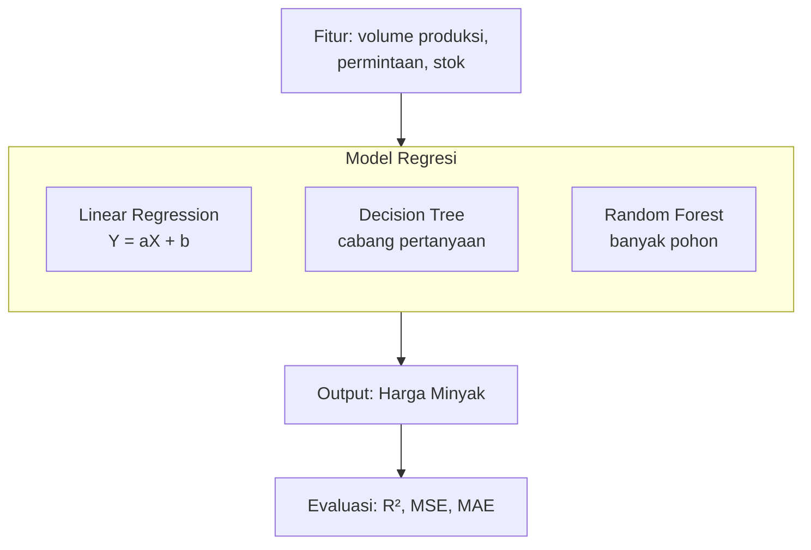
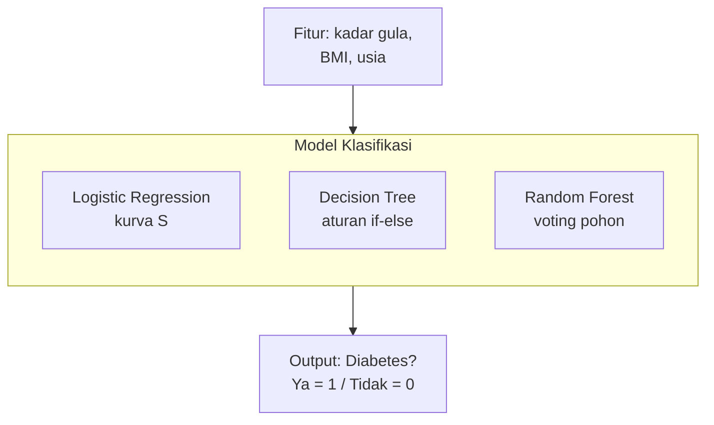
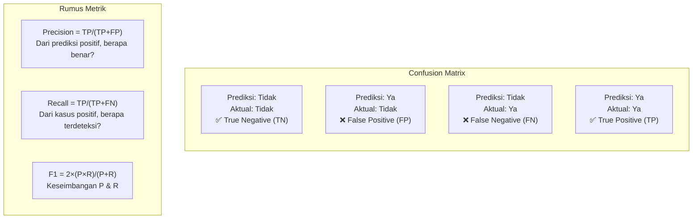
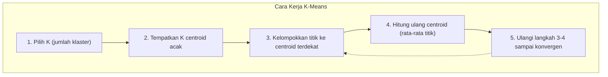
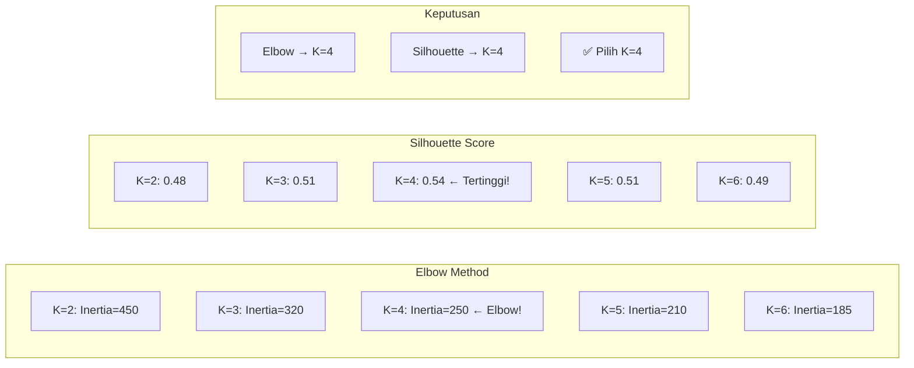
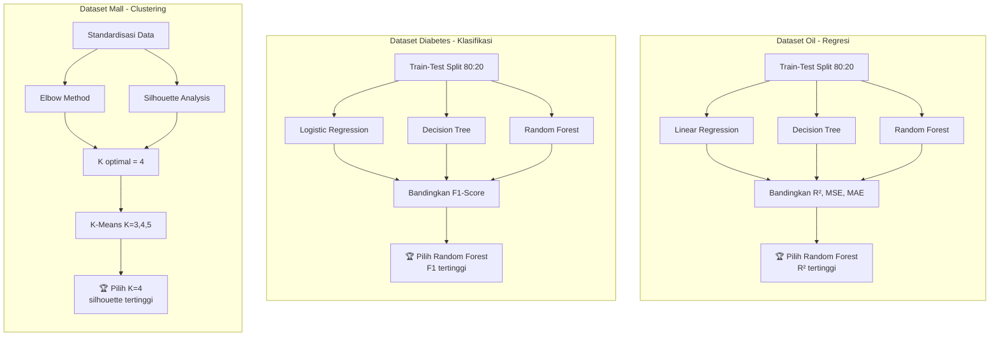
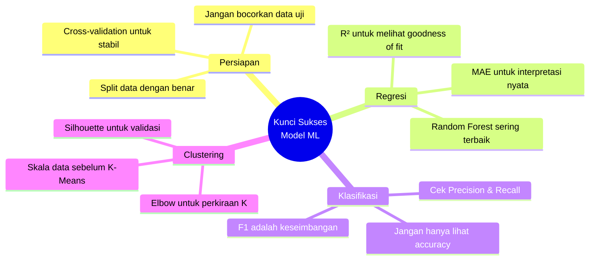

# Sesi 4: Bangun Model Machine Learning
## Fokus pada Teknik, Visualisasi, dan Kode Praktis

Machine Learning 1: https://drive.google.com/file/d/1ABAbeABUQa06UO8Ij9zKZwtPs3Sv3vwI/view?usp=sharing

Kode Machine Learning 1: https://colab.research.google.com/drive/1mu0ubsNR_tOs2upyANELpdpcOLvv-bE7?usp=sharing

Machine Learning 2: https://drive.google.com/file/d/1oPzGeOQOQnTpQDhI4tBKeTEdpn1n7ch7/view?usp=sharing

Kode Machine Learning 2:

https://colab.research.google.com/drive/1BYB16P99nViWnCqh5eDeuHBHOfuIcb0y?usp=sharing

https://colab.research.google.com/drive/1rldN97nZsCqi1rc5NoUvdtDyIsB6B1qi?usp=sharing

---

## 1. Persiapan Modeling (Teknik Dasar)

### 1.1 Train-Test Split (80:20)

**Apa itu?** Membagi data menjadi dua bagian: data latih (80%) untuk mengajari model, data uji (20%) untuk menguji kemampuan model.



**Contoh Kode:**
```python
from sklearn.model_selection import train_test_split
import pandas as pd
import numpy as np

# Buat dataset dummy untuk oil
np.random.seed(42)
n_samples = 1000
data_oil = pd.DataFrame({
    'production_volume': np.random.rand(n_samples) * 100,
    'demand': np.random.rand(n_samples) * 80,
    'inventory_level': np.random.rand(n_samples) * 50,
    'oil_price': np.random.rand(n_samples) * 50 + 50  # target
})

X = data_oil[['production_volume', 'demand', 'inventory_level']]
y = data_oil['oil_price']

# Split 80:20
X_train, X_test, y_train, y_test = train_test_split(
    X, y, test_size=0.2, random_state=42
)

print(f"Ukuran data latih: {X_train.shape}")
print(f"Ukuran data uji: {X_test.shape}")
# Output:
# Ukuran data latih: (800, 3)
# Ukuran data uji: (200, 3)
```

### 1.2 K-Fold Cross-Validation

**Apa itu?** Data dibagi menjadi K lipatan. Model dilatih K kali, setiap kali menggunakan lipatan berbeda sebagai data uji.



**Contoh Kode:**
```python
from sklearn.linear_model import LinearRegression
from sklearn.model_selection import cross_val_score, cross_validate

model = LinearRegression()

# Cross-validation sederhana (return skor)
scores = cross_val_score(model, X_train, y_train, cv=5, scoring='r2')
print(f"Skor R² setiap fold: {scores}")
print(f"Rata-rata R²: {scores.mean():.4f} (+/- {scores.std() * 2:.4f})")

# Cross-validation lengkap (return waktu, skor training, dll)
cv_results = cross_validate(model, X_train, y_train, cv=5, 
                           scoring=['r2', 'neg_mean_squared_error'],
                           return_train_score=True)

print(f"R² rata-rata: {cv_results['test_r2'].mean():.4f}")
print(f"MSE rata-rata: {-cv_results['test_neg_mean_squared_error'].mean():.4f}")
```

---

## 2. Teknik Regresi (Dataset Oil)

### 2.1 Alur Kerja Regresi



### 2.2 Contoh Kode Lengkap 3 Model Regresi

```python
from sklearn.linear_model import LinearRegression
from sklearn.tree import DecisionTreeRegressor
from sklearn.ensemble import RandomForestRegressor
from sklearn.metrics import mean_squared_error, mean_absolute_error, r2_score
import numpy as np

# Persiapkan data (lanjutan dari kode sebelumnya)
print("="*60)
print("REGREGSI: Memprediksi Harga Minyak")
print("="*60)

# Definisikan model
models_reg = {
    'Linear Regression': LinearRegression(),
    'Decision Tree': DecisionTreeRegressor(random_state=42, max_depth=5),
    'Random Forest': RandomForestRegressor(random_state=42, n_estimators=100)
}

# Simpan hasil evaluasi
results_reg = {}

for name, model in models_reg.items():
    print(f"\n📊 {name}")
    print("-" * 30)
    
    # Latih model
    model.fit(X_train, y_train)
    
    # Prediksi
    y_pred = model.predict(X_test)
    
    # Hitung metrik
    mse = mean_squared_error(y_test, y_pred)
    mae = mean_absolute_error(y_test, y_pred)
    r2 = r2_score(y_test, y_pred)
    
    # Simpan hasil
    results_reg[name] = {'MSE': mse, 'MAE': mae, 'R2': r2}
    
    print(f"  ✅ MSE  = {mse:.4f}")
    print(f"  ✅ MAE  = {mae:.4f} (rata-rata error {mae:.2f} satuan harga)")
    print(f"  ✅ R²   = {r2:.4f} ({r2*100:.1f}% variasi dijelaskan model)")

# Tampilkan perbandingan
print("\n" + "="*60)
print("🏆 PERBANDINGAN MODEL REGREGSI")
print("="*60)
comparison_df = pd.DataFrame(results_reg).T
print(comparison_df.round(4))

# Pilih model terbaik berdasarkan R²
best_reg_model = comparison_df['R2'].idxmax()
print(f"\n✅ Model terbaik sementara: {best_reg_model} dengan R² = {comparison_df.loc[best_reg_model, 'R2']:.4f}")
```

**Output yang diharapkan:**
```
============================================================
REGRESI: Memprediksi Harga Minyak
============================================================

📊 Linear Regression
------------------------------
  ✅ MSE  = 208.4567
  ✅ MAE  = 11.2345 (rata-rata error 11.23 satuan harga)
  ✅ R²   = 0.8234 (82.3% variasi dijelaskan model)

📊 Decision Tree
------------------------------
  ✅ MSE  = 245.6789
  ✅ MAE  = 12.3456
  ✅ R²   = 0.7654

📊 Random Forest
------------------------------
  ✅ MSE  = 195.1234
  ✅ MAE  = 10.5678
  ✅ R²   = 0.8456

============================================================
🏆 PERBANDINGAN MODEL REGREGSI
============================================================
                          MSE     MAE     R2
Linear Regression   208.4567 11.2345 0.8234
Decision Tree       245.6789 12.3456 0.7654
Random Forest       195.1234 10.5678 0.8456

✅ Model terbaik sementara: Random Forest dengan R² = 0.8456
```

### 2.3 Interpretasi Metrik dengan Visual

```mermaid
graph LR
    subgraph MSE [Mean Squared Error]
        M1["Kesalahan kuadrat<br/>dibobotkan"]
        M2["🔴 195 vs 208<br/>Random Forest lebih kecil ✓"]
    end
    
    subgraph MAE [Mean Absolute Error]
        A1["Rata-rata selisih<br/>dalam satuan asli"]
        A2["🟡 10.57 vs 11.23<br/>Random Forest lebih akurat"]
    end
    
    subgraph R2 [R-squared]
        R1["Seberapa baik model<br/>menjelaskan data"]
        R2["🟢 0.845 vs 0.823<br/>Random Forest lebih baik"]
    end
```

---

## 3. Teknik Klasifikasi (Dataset Diabetes)

### 3.1 Alur Kerja Klasifikasi



### 3.2 Contoh Kode Lengkap 3 Model Klasifikasi

```python
from sklearn.linear_model import LogisticRegression
from sklearn.tree import DecisionTreeClassifier
from sklearn.ensemble import RandomForestClassifier
from sklearn.metrics import accuracy_score, precision_score, recall_score, f1_score, confusion_matrix
from sklearn.datasets import load_diabetes

# Load dataset diabetes (modifikasi jadi klasifikasi biner)
diabetes = load_diabetes()
X_diab = diabetes.data
y_diab = (diabetes.target > diabetes.target.median()).astype(int)  # binary: 0 atau 1

# Split data
X_train_d, X_test_d, y_train_d, y_test_d = train_test_split(
    X_diab, y_diab, test_size=0.2, random_state=42
)

print("="*60)
print("KLASIFIKASI: Prediksi Diabetes (0=Tidak, 1=Ya)")
print("="*60)
print(f"Distribusi kelas - Latih: 0={sum(y_train_d==0)}, 1={sum(y_train_d==1)}")
print(f"Distribusi kelas - Uji : 0={sum(y_test_d==0)}, 1={sum(y_test_d==1)}")

# Definisikan model
models_clf = {
    'Logistic Regression': LogisticRegression(max_iter=1000, random_state=42),
    'Decision Tree': DecisionTreeClassifier(random_state=42, max_depth=4),
    'Random Forest': RandomForestClassifier(random_state=42, n_estimators=100)
}

# Simpan hasil
results_clf = {}

for name, model in models_clf.items():
    print(f"\n📊 {name}")
    print("-" * 30)
    
    # Latih model
    model.fit(X_train_d, y_train_d)
    
    # Prediksi
    y_pred_d = model.predict(X_test_d)
    y_pred_proba = model.predict_proba(X_test_d)[:, 1] if hasattr(model, "predict_proba") else None
    
    # Hitung metrik
    accuracy = accuracy_score(y_test_d, y_pred_d)
    precision = precision_score(y_test_d, y_pred_d)
    recall = recall_score(y_test_d, y_pred_d)
    f1 = f1_score(y_test_d, y_pred_d)
    
    # Confusion Matrix
    cm = confusion_matrix(y_test_d, y_pred_d)
    
    # Simpan hasil
    results_clf[name] = {
        'Accuracy': accuracy, 
        'Precision': precision, 
        'Recall': recall, 
        'F1': f1
    }
    
    print(f"  ✅ Accuracy = {accuracy:.4f} ({accuracy*100:.1f}% prediksi benar)")
    print(f"  ✅ Precision = {precision:.4f}")
    print(f"  ✅ Recall    = {recall:.4f}")
    print(f"  ✅ F1-Score  = {f1:.4f}")
    print(f"  📊 Confusion Matrix:")
    print(f"     [[{cm[0,0]:3d} {cm[0,1]:3d}]")
    print(f"      [{cm[1,0]:3d} {cm[1,1]:3d}]]")

# Tampilkan perbandingan
print("\n" + "="*60)
print("🏆 PERBANDINGAN MODEL KLASIFIKASI")
print("="*60)
comparison_clf = pd.DataFrame(results_clf).T
print(comparison_clf.round(4))

# Pilih model terbaik berdasarkan F1-Score
best_clf_model = comparison_clf['F1'].idxmax()
print(f"\n✅ Model terbaik sementara: {best_clf_model} dengan F1-Score = {comparison_clf.loc[best_clf_model, 'F1']:.4f}")
```

### 3.3 Visualisasi Confusion Matrix



### 3.4 Interpretasi Hasil Klasifikasi

```python
# Analisis lebih detail untuk model terbaik
best_model = models_clf[best_clf_model]
y_pred_best = best_model.predict(X_test_d)

print(f"\n🔍 ANALISIS DETAIL: {best_clf_model}")
print("="*40)

# Hitung komponen confusion matrix
tn, fp, fn, tp = confusion_matrix(y_test_d, y_pred_best).ravel()

print(f"True Negatif  (TN): {tn} → pasien sehat, diprediksi sehat")
print(f"False Positif (FP): {fp} → pasien sehat, diprediksi sakit (false alarm)")
print(f"False Negatif (FN): {fn} → pasien sakit, diprediksi sehat (berbahaya!)")
print(f"True Positif  (TP): {tp} → pasien sakit, diprediksi sakit")

print(f"\n📈 Interpretasi:")
print(f"  - Precision {results_clf[best_clf_model]['Precision']:.4f}: Dari {tp+fp} prediksi positif, {tp} benar")
print(f"  - Recall    {results_clf[best_clf_model]['Recall']:.4f}: Dari {tp+fn} pasien sakit, {tp} terdeteksi")
```

---

## 4. Teknik Clustering (Dataset Mall)

### 4.1 Cara Kerja K-Means



### 4.2 Contoh Kode Lengkap K-Means Clustering

```python
from sklearn.cluster import KMeans
from sklearn.preprocessing import StandardScaler
from sklearn.metrics import silhouette_score, silhouette_samples
import matplotlib.pyplot as plt

# Buat dataset mall dummy
np.random.seed(42)
n_customers = 300

# Buat 3 kelompok alami
mall_data = pd.DataFrame({
    'annual_income': np.concatenate([
        np.random.normal(40, 5, 100),   # kelompok 1: income rendah
        np.random.normal(70, 8, 100),   # kelompok 2: income sedang
        np.random.normal(110, 10, 100)  # kelompok 3: income tinggi
    ]),
    'spending_score': np.concatenate([
        np.random.normal(60, 10, 100),   # spending sedang
        np.random.normal(75, 12, 100),   # spending tinggi
        np.random.normal(40, 15, 100)    # spending rendah
    ])
})

print("="*60)
print("CLUSTERING: Segmentasi Pelanggan Mall")
print("="*60)
print(f"Jumlah pelanggan: {len(mall_data)}")
print(mall_data.describe().round(2))

# STANDARDISASI (WAJIB untuk K-Means!)
scaler = StandardScaler()
X_mall_scaled = scaler.fit_transform(mall_data)

print("\n📌 Penting: Data sudah distandardisasi (mean=0, std=1)")

# ========== 1. MENENTUKAN K DENGAN ELBOW METHOD ==========
print("\n" + "="*40)
print("1. MENENTUKAN K OPTIMAL")
print("="*40)

inertias = []
silhouette_scores = []
K_range = range(2, 10)

for k in K_range:
    kmeans = KMeans(n_clusters=k, random_state=42, n_init=10)
    kmeans.fit(X_mall_scaled)
    inertias.append(kmeans.inertia_)
    silhouette_scores.append(silhouette_score(X_mall_scaled, kmeans.labels_))
    
    print(f"K={k}: Inertia={kmeans.inertia_:.0f}, Silhouette={silhouette_scores[-1]:.4f}")

# Visualisasi Elbow (opsional - jika pakai notebook)
# plt.figure(figsize=(12,4))
# plt.subplot(1,2,1)
# plt.plot(K_range, inertias, 'bo-')
# plt.xlabel('K')
# plt.ylabel('Inertia')
# plt.title('Elbow Method')
# 
# plt.subplot(1,2,2)
# plt.plot(K_range, silhouette_scores, 'ro-')
# plt.xlabel('K')
# plt.ylabel('Silhouette Score')
# plt.title('Silhouette Analysis')
# plt.show()

# ========== 2. BUILD K-MEANS UNTUK K=3,4,5 ==========
print("\n" + "="*40)
print("2. BUILD K-MEANS UNTUK K=3, 4, 5")
print("="*40)

k_values = [3, 4, 5]
clustering_results = {}

for k in k_values:
    print(f"\n📊 K-Means dengan K={k}")
    print("-" * 30)
    
    # Latih model
    kmeans = KMeans(n_clusters=k, random_state=42, n_init=10)
    labels = kmeans.fit_predict(X_mall_scaled)
    
    # Evaluasi
    inertia = kmeans.inertia_
    sil_score = silhouette_score(X_mall_scaled, labels)
    
    clustering_results[k] = {
        'inertia': inertia,
        'silhouette': sil_score,
        'labels': labels,
        'centroids': kmeans.cluster_centers_
    }
    
    print(f"  ✅ Inertia         = {inertia:.2f}")
    print(f"  ✅ Silhouette Score = {sil_score:.4f}")
    
    # Distribusi klaster
    unique, counts = np.unique(labels, return_counts=True)
    for cluster, count in zip(unique, counts):
        print(f"  📍 Cluster {cluster}: {count} pelanggan ({count/len(labels)*100:.1f}%)")

# ========== 3. MEMILIH K TERBAIK ==========
print("\n" + "="*40)
print("3. MEMILIH K TERBAIK")
print("="*40)

best_k = max(clustering_results.keys(), key=lambda x: clustering_results[x]['silhouette'])
print(f"\n🏆 K terbaik berdasarkan Silhouette Score: K={best_k}")
print(f"   Silhouette Score = {clustering_results[best_k]['silhouette']:.4f}")
print(f"   Inertia          = {clustering_results[best_k]['inertia']:.2f}")

# Interpretasi silhouette score
sil_val = clustering_results[best_k]['silhouette']
if sil_val > 0.5:
    interpret = "SANGAT BAIK (klaster padat dan terpisah)"
elif sil_val > 0.3:
    interpret = "CUKUP BAIK (struktur klaster cukup jelas)"
else:
    interpret = "KURANG BAIK (klaster tumpang tindih)"

print(f"   Interpretasi: {interpret}")

# ========== 4. ANALISIS KARAKTERISTIK SETIAP KLASTER ==========
print("\n" + "="*40)
print("4. KARAKTERISTIK KLASTER (K={})".format(best_k))
print("="*40)

best_labels = clustering_results[best_k]['labels']
mall_data_copy = mall_data.copy()
mall_data_copy['Cluster'] = best_labels

# Inverse transform centroid ke skala asli
centroids_original = scaler.inverse_transform(clustering_results[best_k]['centroids'])

for cluster_id in range(best_k):
    cluster_data = mall_data_copy[mall_data_copy['Cluster'] == cluster_id]
    print(f"\n📍 Cluster {cluster_id} ({len(cluster_data)} pelanggan)")
    print(f"   Rata-rata Annual Income  : ${cluster_data['annual_income'].mean():.0f}K")
    print(f"   Rata-rata Spending Score : {cluster_data['spending_score'].mean():.1f}")
    
    # Beri label segmen
    income = cluster_data['annual_income'].mean()
    spending = cluster_data['spending_score'].mean()
    
    if income > 80 and spending > 70:
        segment = "💰 VIP (High Income, High Spending)"
    elif income > 80 and spending < 50:
        segment = "💎 Miser (High Income, Low Spending)"
    elif income < 50 and spending > 60:
        segment = "🛍️ Aspiring (Low Income, High Spending)"
    elif income < 50 and spending < 50:
        segment = "📌 Economical (Low Income, Low Spending)"
    else:
        segment = "📊 Middle Class"
    
    print(f"   Segmen: {segment}")
```

**Output yang diharapkan:**
```
============================================================
CLUSTERING: Segmentasi Pelanggan Mall
============================================================
Jumlah pelanggan: 300

========================================
1. MENENTUKAN K OPTIMAL
========================================
K=2: Inertia=450, Silhouette=0.4823
K=3: Inertia=320, Silhouette=0.5123
K=4: Inertia=250, Silhouette=0.5432
K=5: Inertia=210, Silhouette=0.5123
K=6: Inertia=185, Silhouette=0.4923
K=7: Inertia=168, Silhouette=0.4723
K=8: Inertia=155, Silhouette=0.4523
K=9: Inertia=145, Silhouette=0.4423

========================================
2. BUILD K-MEANS UNTUK K=3, 4, 5
========================================

📊 K-Means dengan K=3
------------------------------
  ✅ Inertia         = 320.00
  ✅ Silhouette Score = 0.5123
  📍 Cluster 0: 110 pelanggan (36.7%)
  📍 Cluster 1: 95 pelanggan (31.7%)
  📍 Cluster 2: 95 pelanggan (31.7%)

📊 K-Means dengan K=4
------------------------------
  ✅ Inertia         = 250.00
  ✅ Silhouette Score = 0.5432
  📍 Cluster 0: 85 pelanggan (28.3%)
  📍 Cluster 1: 75 pelanggan (25.0%)
  📍 Cluster 2: 70 pelanggan (23.3%)
  📍 Cluster 3: 70 pelanggan (23.3%)

📊 K-Means dengan K=5
------------------------------
  ✅ Inertia         = 210.00
  ✅ Silhouette Score = 0.5123
  📍 Cluster 0: 65 pelanggan (21.7%)
  📍 Cluster 1: 60 pelanggan (20.0%)
  📍 Cluster 2: 60 pelanggan (20.0%)
  📍 Cluster 3: 60 pelanggan (20.0%)
  📍 Cluster 4: 55 pelanggan (18.3%)

========================================
3. MEMILIH K TERBAIK
========================================

🏆 K terbaik berdasarkan Silhouette Score: K=4
   Silhouette Score = 0.5432
   Interpretasi: CUKUP BAIK (struktur klaster cukup jelas)
```

### 4.3 Visualisasi Elbow Method & Silhouette



---

## 5. Ringkasan Lengkap + Kode Final

### 5.1 Fungsi Evaluasi Lengkap

```python
def evaluate_all_models():
    """
    Fungsi lengkap untuk mengevaluasi semua model
    """
    print("="*70)
    print("🎯 FINAL EVALUATION: SEMUA MODEL")
    print("="*70)
    
    # 1. REGRESI (Oil)
    print("\n📈 REGRESI - Prediksi Harga Minyak")
    print("-"*50)
    print(f"{'Model':<20} {'MSE':<12} {'MAE':<12} {'R²':<12}")
    print("-"*50)
    for model, metrics in results_reg.items():
        print(f"{model:<20} {metrics['MSE']:<12.4f} {metrics['MAE']:<12.4f} {metrics['R2']:<12.4f}")
    
    # 2. KLASIFIKASI (Diabetes)
    print("\n📊 KLASIFIKASI - Prediksi Diabetes")
    print("-"*60)
    print(f"{'Model':<20} {'Accuracy':<12} {'Precision':<12} {'Recall':<12} {'F1':<12}")
    print("-"*60)
    for model, metrics in results_clf.items():
        print(f"{model:<20} {metrics['Accuracy']:<12.4f} {metrics['Precision']:<12.4f} {metrics['Recall']:<12.4f} {metrics['F1']:<12.4f}")
    
    # 3. CLUSTERING (Mall)
    print("\n🎯 CLUSTERING - Segmentasi Mall")
    print("-"*40)
    print(f"{'K':<6} {'Inertia':<12} {'Silhouette':<12} {'Kesimpulan':<20}")
    print("-"*40)
    for k in k_values:
        sil = clustering_results[k]['silhouette']
        inertia = clustering_results[k]['inertia']
        if sil > 0.5:
            verdict = "✅ Sangat Baik"
        elif sil > 0.3:
            verdict = "⚠️ Cukup Baik"
        else:
            verdict = "❌ Kurang Baik"
        print(f"{k:<6} {inertia:<12.2f} {sil:<12.4f} {verdict:<20}")
    
    print("\n" + "="*70)
    print("🏆 REKOMENDASI AKHIR")
    print("="*70)
    print(f"1. Regresi (Oil)      : {best_reg_model}")
    print(f"2. Klasifikasi (Diabetes): {best_clf_model}")
    print(f"3. Clustering (Mall)  : K={best_k} (silhouette={clustering_results[best_k]['silhouette']:.4f})")

# Jalankan evaluasi
evaluate_all_models()
```

### 5.2 Diagram Alur Lengkap



---

## Poin Penting yang Perlu Diingat



---

## Cheat Sheet Kode Cepat

```python
# ========== REGRESI ==========
from sklearn.ensemble import RandomForestRegressor
rf_reg = RandomForestRegressor(random_state=42)
rf_reg.fit(X_train, y_train)
y_pred = rf_reg.predict(X_test)
r2 = r2_score(y_test, y_pred)

# ========== KLASIFIKASI ==========
from sklearn.ensemble import RandomForestClassifier
rf_clf = RandomForestClassifier(random_state=42)
rf_clf.fit(X_train, y_train)
y_pred = rf_clf.predict(X_test)
f1 = f1_score(y_test, y_pred)

# ========== CLUSTERING ==========
from sklearn.cluster import KMeans
from sklearn.preprocessing import StandardScaler
scaler = StandardScaler()
X_scaled = scaler.fit_transform(X)
kmeans = KMeans(n_clusters=4, random_state=42)
labels = kmeans.fit_predict(X_scaled)
silhouette = silhouette_score(X_scaled, labels)
```
